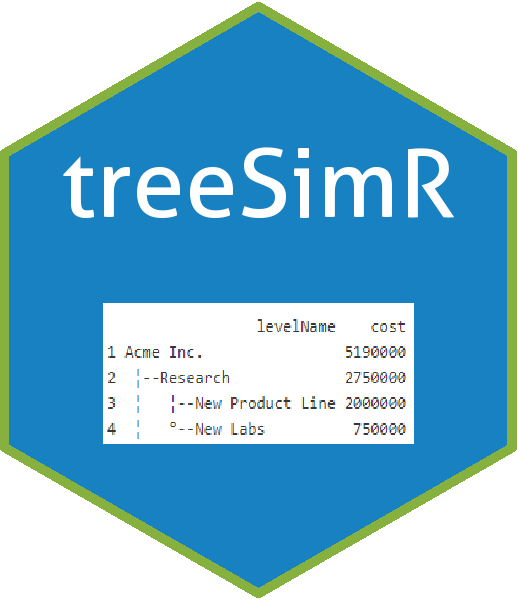

treeSimR 
========================================================================================

<!--
[](http://cran.r-project.org/package=purrr)
[](https://travis-ci.org/tidyverse/purrr)
[](https://codecov.io/github/tidyverse/purrr?branch=master)
-->
Introduction
------------

An R package for easy, robust forward simulating probability decision trees, calculating cost-effectiveness and probability sensitivity analysis (PSA).

Currently contains functions to:

-   read-in and check tree object
-   simulate final expected outcomes
-   Monte-Carlo simulate multiple simulations

*TODO*

-   \[ \] iteratively collapse expected outcome (from right to left)
-   \[ \] iteratively collapse chance nodes (from right to left)
-   \[ \] optimal decision function (iterative from right to left)

The package leans heavily on the `data.tree` package, (introduction [here](https://cran.r-project.org/web/packages/data.tree/vignettes/data.tree.html) and examples [here](https://cran.r-project.org/web/packages/data.tree/vignettes/applications.html) ).

Installing `treeSimR`
---------------------

To install the development version from github:

``` r
library(devtools)
install_github("n8thangreen/treeSimR")
```

Then, to load the package, use:

``` r
library("treeSimR")
```

See package [Vignettes](https://n8thangreen.github.io/treeSimR/articles/vignette_main.html) for more details and examples.

For plotting functions (e.g. C-E plane, C-E curve, risk profile (with uncertainty), tornado, spider, ...) see the [plotCostEffectiveness](https://github.com/n8thangreen/plotCostEffectiveness) package.
