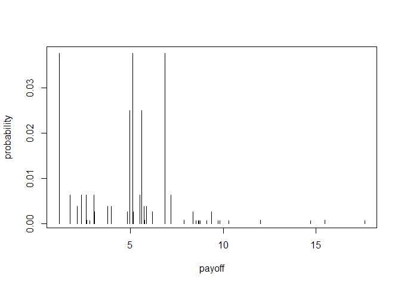

`treeSimR`
==========

An R package for easy forward simulating probability decision trees,
calculating cost-effectiveness and PSA.

Currently contains functions to:

-   read-in and check tree object
-   simulate final expected outcomes
-   Monte-Carlo simulate multiple simulations

*TODO*

-   \[ \] iteratively collapse expected outcome (from right to left)
-   \[ \] iteratively collapse chance nodes (from right to left)
-   \[ \] optimal decision function (iterative from right to left)
-   \[ \] plotting functions: C-E plane, C-E curve, risk profile (with
    uncertainty), tornado, spider, ...

The package leans heavily on the `data.tree` package, (introduction
[here](https://cran.r-project.org/web/packages/data.tree/vignettes/data.tree.html)
and examples
[here](https://cran.r-project.org/web/packages/data.tree/vignettes/applications.html)
).

Installing `treeSimR`
---------------------

To install the development version from github:

    library(devtools)
    install_github("n8thangreen/treeSimR")

Then, to load the package, use:

    library("treeSimR")

Read-in trees
-------------

    ## Loading treeSimR

The raw decision tree file is a tab-spaced file such as the following:

    sink("raw data/LTBI_dtree-cost-distns.yaml")

    cat("
        name: LTBI screening cost
        type: decision
        distn: gamma
        mean: 1
        sd: 1
        Screening:
          distn: gamma
          mean: 1
          sd: 1
          type: chance
          LTBI:
            p: 0.25
            distn: gamma
            mean: 1
            sd: 1
            type: chance
            Not GP registered:
              type: terminal
              p: 0.4
              distn: gamma
              mean: 1
              sd: 1
            GP registered:
              type: chance
              p: 0.4
              distn: gamma
              mean: 1
              sd: 1
              Not Agree to Screen:
                p: 0.6
                type: terminal
                distn: gamma
                mean: 1
                sd: 1
              Agree to Screen:
                p: 0.6
                type: chance
                distn: gamma
                mean: 1
                sd: 1
                Test Negative:
                  type: terminal
                  p: 0.7
                  distn: gamma
                  mean: 1
                  sd: 1
                Test Positive:
                  type: chance
                  p: 0.7
                  distn: gamma
                  mean: 1
                  sd: 1
                  Not Start Treatment:
                    type: terminal
                    p: 0.3
                    distn: gamma
                    mean: 1
                    sd: 1
                  Start Treatment:
                    type: chance
                    p: 0.3
                    distn: gamma
                    mean: 1
                    sd: 1
                    Complete Treatment:
                      type: terminal
                      p: 0.75
                      distn: gamma
                      mean: 1
                      sd: 1
                    Not Complete Treatment:
                      type: terminal
                      p: 0.75
                      distn: gamma
                      mean: 1
                      sd: 1
          non-LTBI:
            p: 0.25
            distn: gamma
            mean: 1
            sd: 1
            type: chance
            Not GP registered:
              type: terminal
              p: 0.4
              distn: gamma
              mean: 1
              sd: 1
            GP registered:
              type: terminal
              p: 0.4
              distn: gamma
              mean: 1
              sd: 1
              Not Agree to Screen:
                p: 0.6
                type: chance
                distn: gamma
                mean: 1
                sd: 1
              Agree to Screen:
                p: 0.6
                type: chance
                distn: gamma
                mean: 1
                sd: 1
                Test Negative:
                  type: terminal
                  p: 0.7
                  distn: gamma
                  mean: 1
                  sd: 1
                Test Positive:
                  type: terminal
                  p: 0.7
                  distn: gamma
                  mean: 1
                  sd: 1
                  Not Start Treatment:
                    type: terminal
                    p: 0.3
                    distn: gamma
                    mean: 1
                    sd: 1
                  Start Treatment:
                    type: terminal
                    p: 0.3
                    distn: gamma
                    mean: 1
                    sd: 1
                    Complete Treatment:
                      type: terminal
                      p: 0.75
                      distn: gamma
                      mean: 1
                      sd: 1
                    Not Complete Treatment:
                      type: terminal
                      p: 0.75
                      distn: gamma
                      mean: 1
                      sd: 1
        No Screening:
          p: 0.25
          distn: gamma
          mean: 1
          sd: 1
          type: chance
          LTBI:
            type: terminal
            p: 0.4
            distn: gamma
            mean: 1
            sd: 1
          non-LTBI:
            p: 0.6
            type: terminal
            distn: gamma
            mean: 1
            sd: 1
        ", fill=TRUE)
    sink()

We save this to a .yaml text file and then read it in as a yaml file to
a data.tree object using the yaml and data.tree packages. This is then
represented as a list in R.

    # osList <- yaml.load(yaml)
    osList <- yaml.load_file("raw data/LTBI_dtree-cost-distns.yaml")
    osNode <- as.Node(osList)
    osNode

    ##                                                 levelName
    ## 1  LTBI screening cost                                   
    ## 2   ¦--under 40k cob incidence                           
    ## 3   ¦   ¦--Screening                                     
    ## 4   ¦   ¦   ¦--LTBI                                      
    ## 5   ¦   ¦   ¦   ¦--Not GP registered                     
    ## 6   ¦   ¦   ¦   °--GP registered                         
    ## 7   ¦   ¦   ¦       ¦--Not Agree to Screen               
    ## 8   ¦   ¦   ¦       °--Agree to Screen                   
    ## 9   ¦   ¦   ¦           ¦--Test Negative                 
    ## 10  ¦   ¦   ¦           °--Test Positive                 
    ## 11  ¦   ¦   ¦               ¦--Not Start Treatment       
    ## 12  ¦   ¦   ¦               °--Start Treatment           
    ## 13  ¦   ¦   ¦                   ¦--Complete Treatment    
    ## 14  ¦   ¦   ¦                   °--Not Complete Treatment
    ## 15  ¦   ¦   °--non-LTBI                                  
    ## 16  ¦   ¦       ¦--Not GP registered                     
    ## 17  ¦   ¦       °--GP registered                         
    ## 18  ¦   ¦           ¦--Not Agree to Screen               
    ## 19  ¦   ¦           °--Agree to Screen                   
    ## 20  ¦   ¦               ¦--Test Negative                 
    ## 21  ¦   ¦               °--Test Positive                 
    ## 22  ¦   ¦                   ¦--Not Start Treatment       
    ## 23  ¦   ¦                   °--Start Treatment           
    ## 24  ¦   ¦                       ¦--Complete Treatment    
    ## 25  ¦   ¦                       °--Not Complete Treatment
    ## 26  ¦   °--No Screening                                  
    ## 27  ¦       ¦--LTBI                                      
    ## 28  ¦       °--non-LTBI                                  
    ## 29  ¦--40-150k cob incidence                             
    ## 30  ¦   ¦--Screening                                     
    ## 31  ¦   ¦   ¦--LTBI                                      
    ## 32  ¦   ¦   ¦   ¦--Not GP registered                     
    ## 33  ¦   ¦   ¦   °--GP registered                         
    ## 34  ¦   ¦   ¦       ¦--Not Agree to Screen               
    ## 35  ¦   ¦   ¦       °--Agree to Screen                   
    ## 36  ¦   ¦   ¦           ¦--Test Negative                 
    ## 37  ¦   ¦   ¦           °--Test Positive                 
    ## 38  ¦   ¦   ¦               ¦--Not Start Treatment       
    ## 39  ¦   ¦   ¦               °--Start Treatment           
    ## 40  ¦   ¦   ¦                   ¦--Complete Treatment    
    ## 41  ¦   ¦   ¦                   °--Not Complete Treatment
    ## 42  ¦   ¦   °--non-LTBI                                  
    ## 43  ¦   ¦       ¦--Not GP registered                     
    ## 44  ¦   ¦       °--GP registered                         
    ## 45  ¦   ¦           ¦--Not Agree to Screen               
    ## 46  ¦   ¦           °--Agree to Screen                   
    ## 47  ¦   ¦               ¦--Test Negative                 
    ## 48  ¦   ¦               °--Test Positive                 
    ## 49  ¦   ¦                   ¦--Not Start Treatment       
    ## 50  ¦   ¦                   °--Start Treatment           
    ## 51  ¦   ¦                       ¦--Complete Treatment    
    ## 52  ¦   ¦                       °--Not Complete Treatment
    ## 53  ¦   °--No Screening                                  
    ## 54  ¦       ¦--LTBI                                      
    ## 55  ¦       °--non-LTBI                                  
    ## 56  °--over 150k cob incidence                           
    ## 57      ¦--Screening                                     
    ## 58      ¦   ¦--LTBI                                      
    ## 59      ¦   ¦   ¦--Not GP registered                     
    ## 60      ¦   ¦   °--GP registered                         
    ## 61      ¦   ¦       ¦--Not Agree to Screen               
    ## 62      ¦   ¦       °--Agree to Screen                   
    ## 63      ¦   ¦           ¦--Test Negative                 
    ## 64      ¦   ¦           °--Test Positive                 
    ## 65      ¦   ¦               ¦--Not Start Treatment       
    ## 66      ¦   ¦               °--Start Treatment           
    ## 67      ¦   ¦                   ¦--Complete Treatment    
    ## 68      ¦   ¦                   °--Not Complete Treatment
    ## 69      ¦   °--non-LTBI                                  
    ## 70      ¦       ¦--Not GP registered                     
    ## 71      ¦       °--GP registered                         
    ## 72      ¦           ¦--Not Agree to Screen               
    ## 73      ¦           °--Agree to Screen                   
    ## 74      ¦               ¦--Test Negative                 
    ## 75      ¦               °--Test Positive                 
    ## 76      ¦                   ¦--Not Start Treatment       
    ## 77      ¦                   °--Start Treatment           
    ## 78      ¦                       ¦--Complete Treatment    
    ## 79      ¦                       °--Not Complete Treatment
    ## 80      °--No Screening                                  
    ## 81          ¦--LTBI                                      
    ## 82          °--non-LTBI

Better still, use the treeSimR package function to do this, checking for
tree integrity and defining an additional costeffectiveness.tree class.

    osNode <- treeSimR::costeffectiveness_tree(yaml_tree = "raw data/LTBI_dtree-cost-distns.yaml")
    print(osNode, "type", "p", "distn", "mean", "sd")

    ##                                                 levelName     type    p distn mean sd
    ## 1  LTBI screening cost                                      chance   NA gamma    1  1
    ## 2   ¦--under 40k cob incidence                              chance 0.25 gamma    1  1
    ## 3   ¦   ¦--Screening                                       logical 0.25 gamma    1  1
    ## 4   ¦   ¦   ¦--LTBI                                         chance 0.25 gamma    1  1
    ## 5   ¦   ¦   ¦   ¦--Not GP registered                      terminal 0.40 gamma    1  1
    ## 6   ¦   ¦   ¦   °--GP registered                            chance 0.40 gamma    1  1
    ## 7   ¦   ¦   ¦       ¦--Not Agree to Screen                terminal 0.60 gamma    1  1
    ## 8   ¦   ¦   ¦       °--Agree to Screen                      chance 0.60 gamma    1  1
    ## 9   ¦   ¦   ¦           ¦--Test Negative                  terminal 0.70 gamma    1  1
    ## 10  ¦   ¦   ¦           °--Test Positive                    chance 0.70 gamma    1  1
    ## 11  ¦   ¦   ¦               ¦--Not Start Treatment        terminal 0.30 gamma    1  1
    ## 12  ¦   ¦   ¦               °--Start Treatment              chance 0.30 gamma    1  1
    ## 13  ¦   ¦   ¦                   ¦--Complete Treatment     terminal 0.75 gamma    1  1
    ## 14  ¦   ¦   ¦                   °--Not Complete Treatment terminal 0.75 gamma    1  1
    ## 15  ¦   ¦   °--non-LTBI                                     chance 0.25 gamma    1  1
    ## 16  ¦   ¦       ¦--Not GP registered                      terminal 0.40 gamma    1  1
    ## 17  ¦   ¦       °--GP registered                            chance 0.40 gamma    1  1
    ## 18  ¦   ¦           ¦--Not Agree to Screen                terminal 0.60 gamma    1  1
    ## 19  ¦   ¦           °--Agree to Screen                      chance 0.60 gamma    1  1
    ## 20  ¦   ¦               ¦--Test Negative                  terminal 0.70 gamma    1  1
    ## 21  ¦   ¦               °--Test Positive                    chance 0.70 gamma    1  1
    ## 22  ¦   ¦                   ¦--Not Start Treatment        terminal 0.30 gamma    1  1
    ## 23  ¦   ¦                   °--Start Treatment              chance 0.30 gamma    1  1
    ## 24  ¦   ¦                       ¦--Complete Treatment     terminal 0.75 gamma    1  1
    ## 25  ¦   ¦                       °--Not Complete Treatment terminal 0.75 gamma    1  1
    ## 26  ¦   °--No Screening                                    logical 0.25 gamma    1  1
    ## 27  ¦       ¦--LTBI                                       terminal 0.40 gamma    1  1
    ## 28  ¦       °--non-LTBI                                   terminal 0.60 gamma    1  1
    ## 29  ¦--40-150k cob incidence                                chance 0.25 gamma    1  1
    ## 30  ¦   ¦--Screening                                       logical 0.25 gamma    1  1
    ## 31  ¦   ¦   ¦--LTBI                                         chance 0.25 gamma    1  1
    ## 32  ¦   ¦   ¦   ¦--Not GP registered                      terminal 0.40 gamma    1  1
    ## 33  ¦   ¦   ¦   °--GP registered                            chance 0.40 gamma    1  1
    ## 34  ¦   ¦   ¦       ¦--Not Agree to Screen                terminal 0.60 gamma    1  1
    ## 35  ¦   ¦   ¦       °--Agree to Screen                      chance 0.60 gamma    1  1
    ## 36  ¦   ¦   ¦           ¦--Test Negative                  terminal 0.70 gamma    1  1
    ## 37  ¦   ¦   ¦           °--Test Positive                    chance 0.70 gamma    1  1
    ## 38  ¦   ¦   ¦               ¦--Not Start Treatment        terminal 0.30 gamma    1  1
    ## 39  ¦   ¦   ¦               °--Start Treatment              chance 0.30 gamma    1  1
    ## 40  ¦   ¦   ¦                   ¦--Complete Treatment     terminal 0.75 gamma    1  1
    ## 41  ¦   ¦   ¦                   °--Not Complete Treatment terminal 0.75 gamma    1  1
    ## 42  ¦   ¦   °--non-LTBI                                     chance 0.25 gamma    1  1
    ## 43  ¦   ¦       ¦--Not GP registered                      terminal 0.40 gamma    1  1
    ## 44  ¦   ¦       °--GP registered                            chance 0.40 gamma    1  1
    ## 45  ¦   ¦           ¦--Not Agree to Screen                terminal 0.60 gamma    1  1
    ## 46  ¦   ¦           °--Agree to Screen                      chance 0.60 gamma    1  1
    ## 47  ¦   ¦               ¦--Test Negative                  terminal 0.70 gamma    1  1
    ## 48  ¦   ¦               °--Test Positive                    chance 0.70 gamma    1  1
    ## 49  ¦   ¦                   ¦--Not Start Treatment        terminal 0.30 gamma    1  1
    ## 50  ¦   ¦                   °--Start Treatment              chance 0.30 gamma    1  1
    ## 51  ¦   ¦                       ¦--Complete Treatment     terminal 0.75 gamma    1  1
    ## 52  ¦   ¦                       °--Not Complete Treatment terminal 0.75 gamma    1  1
    ## 53  ¦   °--No Screening                                    logical 0.25 gamma    1  1
    ## 54  ¦       ¦--LTBI                                       terminal 0.40 gamma    1  1
    ## 55  ¦       °--non-LTBI                                   terminal 0.60 gamma    1  1
    ## 56  °--over 150k cob incidence                              chance 0.25 gamma    1  1
    ## 57      ¦--Screening                                       logical 0.25 gamma    1  1
    ## 58      ¦   ¦--LTBI                                         chance 0.25 gamma    1  1
    ## 59      ¦   ¦   ¦--Not GP registered                      terminal 0.40 gamma    1  1
    ## 60      ¦   ¦   °--GP registered                            chance 0.40 gamma    1  1
    ## 61      ¦   ¦       ¦--Not Agree to Screen                terminal 0.60 gamma    1  1
    ## 62      ¦   ¦       °--Agree to Screen                      chance 0.60 gamma    1  1
    ## 63      ¦   ¦           ¦--Test Negative                  terminal 0.70 gamma    1  1
    ## 64      ¦   ¦           °--Test Positive                    chance 0.70 gamma    1  1
    ## 65      ¦   ¦               ¦--Not Start Treatment        terminal 0.30 gamma    1  1
    ## 66      ¦   ¦               °--Start Treatment              chance 0.30 gamma    1  1
    ## 67      ¦   ¦                   ¦--Complete Treatment     terminal 0.75 gamma    1  1
    ## 68      ¦   ¦                   °--Not Complete Treatment terminal 0.75 gamma    1  1
    ## 69      ¦   °--non-LTBI                                     chance 0.25 gamma    1  1
    ## 70      ¦       ¦--Not GP registered                      terminal 0.40 gamma    1  1
    ## 71      ¦       °--GP registered                            chance 0.40 gamma    1  1
    ## 72      ¦           ¦--Not Agree to Screen                terminal 0.60 gamma    1  1
    ## 73      ¦           °--Agree to Screen                      chance 0.60 gamma    1  1
    ## 74      ¦               ¦--Test Negative                  terminal 0.70 gamma    1  1
    ## 75      ¦               °--Test Positive                    chance 0.70 gamma    1  1
    ## 76      ¦                   ¦--Not Start Treatment        terminal 0.30 gamma    1  1
    ## 77      ¦                   °--Start Treatment              chance 0.30 gamma    1  1
    ## 78      ¦                       ¦--Complete Treatment     terminal 0.75 gamma    1  1
    ## 79      ¦                       °--Not Complete Treatment terminal 0.75 gamma    1  1
    ## 80      °--No Screening                                    logical 0.25 gamma    1  1
    ## 81          ¦--LTBI                                       terminal 0.40 gamma    1  1
    ## 82          °--non-LTBI                                   terminal 0.60 gamma    1  1

A neat way of exploring the tree is with the `listviewer` package
widget.

    library(listviewer)
    l <- ToListSimple(osNode)
    jsonedit(l)

Simulate a scenario
-------------------

We can now sample values for each branch, given the distributions
defined for each. This could be the cost or health detriment.

    rpayoff <- osNode$Get(sampleNode)
    osNode$Set(payoff = rpayoff)
    print(osNode, "type", "p", "distn", "mean", "sd", "payoff")

    ##                                                 levelName     type    p distn mean sd      payoff
    ## 1  LTBI screening cost                                      chance   NA gamma    1  1 0.148121602
    ## 2   ¦--under 40k cob incidence                              chance 0.25 gamma    1  1 0.212166936
    ## 3   ¦   ¦--Screening                                       logical 0.25 gamma    1  1 0.865640381
    ## 4   ¦   ¦   ¦--LTBI                                         chance 0.25 gamma    1  1 1.758091126
    ## 5   ¦   ¦   ¦   ¦--Not GP registered                      terminal 0.40 gamma    1  1 0.372930915
    ## 6   ¦   ¦   ¦   °--GP registered                            chance 0.40 gamma    1  1 0.284242198
    ## 7   ¦   ¦   ¦       ¦--Not Agree to Screen                terminal 0.60 gamma    1  1 1.215143882
    ## 8   ¦   ¦   ¦       °--Agree to Screen                      chance 0.60 gamma    1  1 0.723140536
    ## 9   ¦   ¦   ¦           ¦--Test Negative                  terminal 0.70 gamma    1  1 0.607345682
    ## 10  ¦   ¦   ¦           °--Test Positive                    chance 0.70 gamma    1  1 0.204387158
    ## 11  ¦   ¦   ¦               ¦--Not Start Treatment        terminal 0.30 gamma    1  1 0.628976820
    ## 12  ¦   ¦   ¦               °--Start Treatment              chance 0.30 gamma    1  1 0.388697306
    ## 13  ¦   ¦   ¦                   ¦--Complete Treatment     terminal 0.75 gamma    1  1 0.762288752
    ## 14  ¦   ¦   ¦                   °--Not Complete Treatment terminal 0.75 gamma    1  1 1.078305133
    ## 15  ¦   ¦   °--non-LTBI                                     chance 0.25 gamma    1  1 0.457979802
    ## 16  ¦   ¦       ¦--Not GP registered                      terminal 0.40 gamma    1  1 3.189246956
    ## 17  ¦   ¦       °--GP registered                            chance 0.40 gamma    1  1 0.331307025
    ## 18  ¦   ¦           ¦--Not Agree to Screen                terminal 0.60 gamma    1  1 0.424685967
    ## 19  ¦   ¦           °--Agree to Screen                      chance 0.60 gamma    1  1 1.192290275
    ## 20  ¦   ¦               ¦--Test Negative                  terminal 0.70 gamma    1  1 0.691899502
    ## 21  ¦   ¦               °--Test Positive                    chance 0.70 gamma    1  1 0.426733231
    ## 22  ¦   ¦                   ¦--Not Start Treatment        terminal 0.30 gamma    1  1 0.990937881
    ## 23  ¦   ¦                   °--Start Treatment              chance 0.30 gamma    1  1 0.003409048
    ## 24  ¦   ¦                       ¦--Complete Treatment     terminal 0.75 gamma    1  1 0.696456337
    ## 25  ¦   ¦                       °--Not Complete Treatment terminal 0.75 gamma    1  1 1.037790477
    ## 26  ¦   °--No Screening                                    logical 0.25 gamma    1  1 2.940532392
    ## 27  ¦       ¦--LTBI                                       terminal 0.40 gamma    1  1 1.440723221
    ## 28  ¦       °--non-LTBI                                   terminal 0.60 gamma    1  1 0.270594187
    ## 29  ¦--40-150k cob incidence                                chance 0.25 gamma    1  1 1.072365358
    ## 30  ¦   ¦--Screening                                       logical 0.25 gamma    1  1 0.050337749
    ## 31  ¦   ¦   ¦--LTBI                                         chance 0.25 gamma    1  1 0.042043872
    ## 32  ¦   ¦   ¦   ¦--Not GP registered                      terminal 0.40 gamma    1  1 0.088073418
    ## 33  ¦   ¦   ¦   °--GP registered                            chance 0.40 gamma    1  1 1.184821257
    ## 34  ¦   ¦   ¦       ¦--Not Agree to Screen                terminal 0.60 gamma    1  1 3.284264107
    ## 35  ¦   ¦   ¦       °--Agree to Screen                      chance 0.60 gamma    1  1 0.420727381
    ## 36  ¦   ¦   ¦           ¦--Test Negative                  terminal 0.70 gamma    1  1 0.014204063
    ## 37  ¦   ¦   ¦           °--Test Positive                    chance 0.70 gamma    1  1 1.818039292
    ## 38  ¦   ¦   ¦               ¦--Not Start Treatment        terminal 0.30 gamma    1  1 0.081521938
    ## 39  ¦   ¦   ¦               °--Start Treatment              chance 0.30 gamma    1  1 3.559460112
    ## 40  ¦   ¦   ¦                   ¦--Complete Treatment     terminal 0.75 gamma    1  1 1.429281747
    ## 41  ¦   ¦   ¦                   °--Not Complete Treatment terminal 0.75 gamma    1  1 0.098882361
    ## 42  ¦   ¦   °--non-LTBI                                     chance 0.25 gamma    1  1 0.519415980
    ## 43  ¦   ¦       ¦--Not GP registered                      terminal 0.40 gamma    1  1 0.497810834
    ## 44  ¦   ¦       °--GP registered                            chance 0.40 gamma    1  1 0.416206547
    ## 45  ¦   ¦           ¦--Not Agree to Screen                terminal 0.60 gamma    1  1 0.680842841
    ## 46  ¦   ¦           °--Agree to Screen                      chance 0.60 gamma    1  1 0.552182859
    ## 47  ¦   ¦               ¦--Test Negative                  terminal 0.70 gamma    1  1 0.432235908
    ## 48  ¦   ¦               °--Test Positive                    chance 0.70 gamma    1  1 1.228371935
    ## 49  ¦   ¦                   ¦--Not Start Treatment        terminal 0.30 gamma    1  1 0.812883208
    ## 50  ¦   ¦                   °--Start Treatment              chance 0.30 gamma    1  1 2.418805022
    ## 51  ¦   ¦                       ¦--Complete Treatment     terminal 0.75 gamma    1  1 0.131356812
    ## 52  ¦   ¦                       °--Not Complete Treatment terminal 0.75 gamma    1  1 0.648863601
    ## 53  ¦   °--No Screening                                    logical 0.25 gamma    1  1 3.023688231
    ## 54  ¦       ¦--LTBI                                       terminal 0.40 gamma    1  1 0.285908054
    ## 55  ¦       °--non-LTBI                                   terminal 0.60 gamma    1  1 1.106621777
    ## 56  °--over 150k cob incidence                              chance 0.25 gamma    1  1 0.837464222
    ## 57      ¦--Screening                                       logical 0.25 gamma    1  1 0.196535654
    ## 58      ¦   ¦--LTBI                                         chance 0.25 gamma    1  1 1.385590351
    ## 59      ¦   ¦   ¦--Not GP registered                      terminal 0.40 gamma    1  1 1.049127759
    ## 60      ¦   ¦   °--GP registered                            chance 0.40 gamma    1  1 1.374841541
    ## 61      ¦   ¦       ¦--Not Agree to Screen                terminal 0.60 gamma    1  1 1.263993406
    ## 62      ¦   ¦       °--Agree to Screen                      chance 0.60 gamma    1  1 0.261422514
    ## 63      ¦   ¦           ¦--Test Negative                  terminal 0.70 gamma    1  1 1.122230566
    ## 64      ¦   ¦           °--Test Positive                    chance 0.70 gamma    1  1 0.254200733
    ## 65      ¦   ¦               ¦--Not Start Treatment        terminal 0.30 gamma    1  1 1.959835988
    ## 66      ¦   ¦               °--Start Treatment              chance 0.30 gamma    1  1 0.178793933
    ## 67      ¦   ¦                   ¦--Complete Treatment     terminal 0.75 gamma    1  1 1.330828715
    ## 68      ¦   ¦                   °--Not Complete Treatment terminal 0.75 gamma    1  1 0.690573874
    ## 69      ¦   °--non-LTBI                                     chance 0.25 gamma    1  1 0.158007869
    ## 70      ¦       ¦--Not GP registered                      terminal 0.40 gamma    1  1 1.125596338
    ## 71      ¦       °--GP registered                            chance 0.40 gamma    1  1 2.576345873
    ## 72      ¦           ¦--Not Agree to Screen                terminal 0.60 gamma    1  1 2.652746832
    ## 73      ¦           °--Agree to Screen                      chance 0.60 gamma    1  1 1.423274252
    ## 74      ¦               ¦--Test Negative                  terminal 0.70 gamma    1  1 1.334726187
    ## 75      ¦               °--Test Positive                    chance 0.70 gamma    1  1 1.192005088
    ## 76      ¦                   ¦--Not Start Treatment        terminal 0.30 gamma    1  1 0.569174198
    ## 77      ¦                   °--Start Treatment              chance 0.30 gamma    1  1 0.943901675
    ## 78      ¦                       ¦--Complete Treatment     terminal 0.75 gamma    1  1 0.302389390
    ## 79      ¦                       °--Not Complete Treatment terminal 0.75 gamma    1  1 1.278774502
    ## 80      °--No Screening                                    logical 0.25 gamma    1  1 1.159837181
    ## 81          ¦--LTBI                                       terminal 0.40 gamma    1  1 0.619848311
    ## 82          °--non-LTBI                                   terminal 0.60 gamma    1  1 0.445833158

Now given the sampled values, e.g. cost, and the probabilities, we can
calculate the expected values at each node, from leaf to root.

    osNode$Do(payoff, traversal = "post-order", filterFun = isNotLeaf)

    print(osNode, "type", "p", "distn", "mean", "sd", "payoff")

    ##                                                 levelName     type    p distn mean sd     payoff
    ## 1  LTBI screening cost                                      chance   NA gamma    1  1 0.22285614
    ## 2   ¦--under 40k cob incidence                              chance 0.25 gamma    1  1 0.32550371
    ## 3   ¦   ¦--Screening                                       logical 0.25 gamma    1  1 0.56336905
    ## 4   ¦   ¦   ¦--LTBI                                         chance 0.25 gamma    1  1 0.64411585
    ## 5   ¦   ¦   ¦   ¦--Not GP registered                      terminal 0.40 gamma    1  1 0.37293092
    ## 6   ¦   ¦   ¦   °--GP registered                            chance 0.40 gamma    1  1 1.23735872
    ## 7   ¦   ¦   ¦       ¦--Not Agree to Screen                terminal 0.60 gamma    1  1 1.21514388
    ## 8   ¦   ¦   ¦       °--Agree to Screen                      chance 0.60 gamma    1  1 0.84712065
    ## 9   ¦   ¦   ¦           ¦--Test Negative                  terminal 0.70 gamma    1  1 0.60734568
    ## 10  ¦   ¦   ¦           °--Test Positive                    chance 0.70 gamma    1  1 0.60282667
    ## 11  ¦   ¦   ¦               ¦--Not Start Treatment        terminal 0.30 gamma    1  1 0.62897682
    ## 12  ¦   ¦   ¦               °--Start Treatment              chance 0.30 gamma    1  1 1.38044541
    ## 13  ¦   ¦   ¦                   ¦--Complete Treatment     terminal 0.75 gamma    1  1 0.76228875
    ## 14  ¦   ¦   ¦                   °--Not Complete Treatment terminal 0.75 gamma    1  1 1.07830513
    ## 15  ¦   ¦   °--non-LTBI                                     chance 0.25 gamma    1  1 1.60936033
    ## 16  ¦   ¦       ¦--Not GP registered                      terminal 0.40 gamma    1  1 3.18924696
    ## 17  ¦   ¦       °--GP registered                            chance 0.40 gamma    1  1 0.83415387
    ## 18  ¦   ¦           ¦--Not Agree to Screen                terminal 0.60 gamma    1  1 0.42468597
    ## 19  ¦   ¦           °--Agree to Screen                      chance 0.60 gamma    1  1 0.96557048
    ## 20  ¦   ¦               ¦--Test Negative                  terminal 0.70 gamma    1  1 0.69189950
    ## 21  ¦   ¦               °--Test Positive                    chance 0.70 gamma    1  1 0.68748690
    ## 22  ¦   ¦                   ¦--Not Start Treatment        terminal 0.30 gamma    1  1 0.99093788
    ## 23  ¦   ¦                   °--Start Treatment              chance 0.30 gamma    1  1 1.30068511
    ## 24  ¦   ¦                       ¦--Complete Treatment     terminal 0.75 gamma    1  1 0.69645634
    ## 25  ¦   ¦                       °--Not Complete Treatment terminal 0.75 gamma    1  1 1.03779048
    ## 26  ¦   °--No Screening                                    logical 0.25 gamma    1  1 0.73864580
    ## 27  ¦       ¦--LTBI                                       terminal 0.40 gamma    1  1 1.44072322
    ## 28  ¦       °--non-LTBI                                   terminal 0.60 gamma    1  1 0.27059419
    ## 29  ¦--40-150k cob incidence                                chance 0.25 gamma    1  1 0.28166634
    ## 30  ¦   ¦--Screening                                       logical 0.25 gamma    1  1 0.34832906
    ## 31  ¦   ¦   ¦--LTBI                                         chance 0.25 gamma    1  1 0.88771234
    ## 32  ¦   ¦   ¦   ¦--Not GP registered                      terminal 0.40 gamma    1  1 0.08807342
    ## 33  ¦   ¦   ¦   °--GP registered                            chance 0.40 gamma    1  1 2.13120744
    ## 34  ¦   ¦   ¦       ¦--Not Agree to Screen                terminal 0.60 gamma    1  1 3.28426411
    ## 35  ¦   ¦   ¦       °--Agree to Screen                      chance 0.60 gamma    1  1 0.26774830
    ## 36  ¦   ¦   ¦           ¦--Test Negative                  terminal 0.70 gamma    1  1 0.01420406
    ## 37  ¦   ¦   ¦           °--Test Positive                    chance 0.70 gamma    1  1 0.36829351
    ## 38  ¦   ¦   ¦               ¦--Not Start Treatment        terminal 0.30 gamma    1  1 0.08152194
    ## 39  ¦   ¦   ¦               °--Start Treatment              chance 0.30 gamma    1  1 1.14612308
    ## 40  ¦   ¦   ¦                   ¦--Complete Treatment     terminal 0.75 gamma    1  1 1.42928175
    ## 41  ¦   ¦   ¦                   °--Not Complete Treatment terminal 0.75 gamma    1  1 0.09888236
    ## 42  ¦   ¦   °--non-LTBI                                     chance 0.25 gamma    1  1 0.50560389
    ## 43  ¦   ¦       ¦--Not GP registered                      terminal 0.40 gamma    1  1 0.49781083
    ## 44  ¦   ¦       °--GP registered                            chance 0.40 gamma    1  1 0.76619890
    ## 45  ¦   ¦           ¦--Not Agree to Screen                terminal 0.60 gamma    1  1 0.68084284
    ## 46  ¦   ¦           °--Agree to Screen                      chance 0.60 gamma    1  1 0.59615532
    ## 47  ¦   ¦               ¦--Test Negative                  terminal 0.70 gamma    1  1 0.43223591
    ## 48  ¦   ¦               °--Test Positive                    chance 0.70 gamma    1  1 0.41941456
    ## 49  ¦   ¦                   ¦--Not Start Treatment        terminal 0.30 gamma    1  1 0.81288321
    ## 50  ¦   ¦                   °--Start Treatment              chance 0.30 gamma    1  1 0.58516531
    ## 51  ¦   ¦                       ¦--Complete Treatment     terminal 0.75 gamma    1  1 0.13135681
    ## 52  ¦   ¦                       °--Not Complete Treatment terminal 0.75 gamma    1  1 0.64886360
    ## 53  ¦   °--No Screening                                    logical 0.25 gamma    1  1 0.77833629
    ## 54  ¦       ¦--LTBI                                       terminal 0.40 gamma    1  1 0.28590805
    ## 55  ¦       °--non-LTBI                                   terminal 0.60 gamma    1  1 1.10662178
    ## 56  °--over 150k cob incidence                              chance 0.25 gamma    1  1 0.28425450
    ## 57      ¦--Screening                                       logical 0.25 gamma    1  1 0.62157879
    ## 58      ¦   ¦--LTBI                                         chance 0.25 gamma    1  1 1.08672901
    ## 59      ¦   ¦   ¦--Not GP registered                      terminal 0.40 gamma    1  1 1.04912776
    ## 60      ¦   ¦   °--GP registered                            chance 0.40 gamma    1  1 1.66769476
    ## 61      ¦   ¦       ¦--Not Agree to Screen                terminal 0.60 gamma    1  1 1.26399341
    ## 62      ¦   ¦       °--Agree to Screen                      chance 0.60 gamma    1  1 1.51549786
    ## 63      ¦   ¦           ¦--Test Negative                  terminal 0.70 gamma    1  1 1.12223057
    ## 64      ¦   ¦           °--Test Positive                    chance 0.70 gamma    1  1 1.04276638
    ## 65      ¦   ¦               ¦--Not Start Treatment        terminal 0.30 gamma    1  1 1.95983599
    ## 66      ¦   ¦               °--Start Treatment              chance 0.30 gamma    1  1 1.51605194
    ## 67      ¦   ¦                   ¦--Complete Treatment     terminal 0.75 gamma    1  1 1.33082872
    ## 68      ¦   ¦                   °--Not Complete Treatment terminal 0.75 gamma    1  1 0.69057387
    ## 69      ¦   °--non-LTBI                                     chance 0.25 gamma    1  1 1.39958615
    ## 70      ¦       ¦--Not GP registered                      terminal 0.40 gamma    1  1 1.12559634
    ## 71      ¦       °--GP registered                            chance 0.40 gamma    1  1 2.37336903
    ## 72      ¦           ¦--Not Agree to Screen                terminal 0.60 gamma    1  1 2.65274683
    ## 73      ¦           °--Agree to Screen                      chance 0.60 gamma    1  1 1.30286823
    ## 74      ¦               ¦--Test Negative                  terminal 0.70 gamma    1  1 1.33472619
    ## 75      ¦               °--Test Positive                    chance 0.70 gamma    1  1 0.52651413
    ## 76      ¦                   ¦--Not Start Treatment        terminal 0.30 gamma    1  1 0.56917420
    ## 77      ¦                   °--Start Treatment              chance 0.30 gamma    1  1 1.18587292
    ## 78      ¦                       ¦--Complete Treatment     terminal 0.75 gamma    1  1 0.30238939
    ## 79      ¦                       °--Not Complete Treatment terminal 0.75 gamma    1  1 1.27877450
    ## 80      °--No Screening                                    logical 0.25 gamma    1  1 0.51543922
    ## 81          ¦--LTBI                                       terminal 0.40 gamma    1  1 0.61984831
    ## 82          °--non-LTBI                                   terminal 0.60 gamma    1  1 0.44583316

Similarly to above, we have created a better wrapper function to perform
these steps:

    osNode <- calc_expectedValues(osNode)
    print(osNode, "type", "p", "distn", "mean", "sd", "payoff")

    ##                                                 levelName     type    p distn mean sd     payoff
    ## 1  LTBI screening cost                                      chance   NA gamma    1  1 0.18700915
    ## 2   ¦--under 40k cob incidence                              chance 0.25 gamma    1  1 0.36265017
    ## 3   ¦   ¦--Screening                                       logical 0.25 gamma    1  1 0.26803713
    ## 4   ¦   ¦   ¦--LTBI                                         chance 0.25 gamma    1  1 0.41522516
    ## 5   ¦   ¦   ¦   ¦--Not GP registered                      terminal 0.40 gamma    1  1 0.12881772
    ## 6   ¦   ¦   ¦   °--GP registered                            chance 0.40 gamma    1  1 0.90924519
    ## 7   ¦   ¦   ¦       ¦--Not Agree to Screen                terminal 0.60 gamma    1  1 1.01885841
    ## 8   ¦   ¦   ¦       °--Agree to Screen                      chance 0.60 gamma    1  1 0.49655023
    ## 9   ¦   ¦   ¦           ¦--Test Negative                  terminal 0.70 gamma    1  1 0.53504796
    ## 10  ¦   ¦   ¦           °--Test Positive                    chance 0.70 gamma    1  1 0.17430951
    ## 11  ¦   ¦   ¦               ¦--Not Start Treatment        terminal 0.30 gamma    1  1 0.34821524
    ## 12  ¦   ¦   ¦               °--Start Treatment              chance 0.30 gamma    1  1 0.23281647
    ## 13  ¦   ¦   ¦                   ¦--Complete Treatment     terminal 0.75 gamma    1  1 0.19447197
    ## 14  ¦   ¦   ¦                   °--Not Complete Treatment terminal 0.75 gamma    1  1 0.11595000
    ## 15  ¦   ¦   °--non-LTBI                                     chance 0.25 gamma    1  1 0.65692338
    ## 16  ¦   ¦       ¦--Not GP registered                      terminal 0.40 gamma    1  1 0.78956699
    ## 17  ¦   ¦       °--GP registered                            chance 0.40 gamma    1  1 0.85274146
    ## 18  ¦   ¦           ¦--Not Agree to Screen                terminal 0.60 gamma    1  1 0.74921874
    ## 19  ¦   ¦           °--Agree to Screen                      chance 0.60 gamma    1  1 0.67201702
    ## 20  ¦   ¦               ¦--Test Negative                  terminal 0.70 gamma    1  1 0.61054280
    ## 21  ¦   ¦               °--Test Positive                    chance 0.70 gamma    1  1 0.34948151
    ## 22  ¦   ¦                   ¦--Not Start Treatment        terminal 0.30 gamma    1  1 0.27256949
    ## 23  ¦   ¦                   °--Start Treatment              chance 0.30 gamma    1  1 0.89236887
    ## 24  ¦   ¦                       ¦--Complete Treatment     terminal 0.75 gamma    1  1 0.25417824
    ## 25  ¦   ¦                       °--Not Complete Treatment terminal 0.75 gamma    1  1 0.93564692
    ## 26  ¦   °--No Screening                                    logical 0.25 gamma    1  1 1.18256355
    ## 27  ¦       ¦--LTBI                                       terminal 0.40 gamma    1  1 1.35739070
    ## 28  ¦       °--non-LTBI                                   terminal 0.60 gamma    1  1 1.06601212
    ## 29  ¦--40-150k cob incidence                                chance 0.25 gamma    1  1 0.24786062
    ## 30  ¦   ¦--Screening                                       logical 0.25 gamma    1  1 0.32952764
    ## 31  ¦   ¦   ¦--LTBI                                         chance 0.25 gamma    1  1 0.27136695
    ## 32  ¦   ¦   ¦   ¦--Not GP registered                      terminal 0.40 gamma    1  1 0.03474743
    ## 33  ¦   ¦   ¦   °--GP registered                            chance 0.40 gamma    1  1 0.64366995
    ## 34  ¦   ¦   ¦       ¦--Not Agree to Screen                terminal 0.60 gamma    1  1 0.07526700
    ## 35  ¦   ¦   ¦       °--Agree to Screen                      chance 0.60 gamma    1  1 0.99751625
    ## 36  ¦   ¦   ¦           ¦--Test Negative                  terminal 0.70 gamma    1  1 0.40887832
    ## 37  ¦   ¦   ¦           °--Test Positive                    chance 0.70 gamma    1  1 1.01614490
    ## 38  ¦   ¦   ¦               ¦--Not Start Treatment        terminal 0.30 gamma    1  1 0.06289032
    ## 39  ¦   ¦   ¦               °--Start Treatment              chance 0.30 gamma    1  1 3.32425935
    ## 40  ¦   ¦   ¦                   ¦--Complete Treatment     terminal 0.75 gamma    1  1 1.69157491
    ## 41  ¦   ¦   ¦                   °--Not Complete Treatment terminal 0.75 gamma    1  1 2.74077089
    ## 42  ¦   ¦   °--non-LTBI                                     chance 0.25 gamma    1  1 1.04674362
    ## 43  ¦   ¦       ¦--Not GP registered                      terminal 0.40 gamma    1  1 1.20641323
    ## 44  ¦   ¦       °--GP registered                            chance 0.40 gamma    1  1 1.41044581
    ## 45  ¦   ¦           ¦--Not Agree to Screen                terminal 0.60 gamma    1  1 1.44811107
    ## 46  ¦   ¦           °--Agree to Screen                      chance 0.60 gamma    1  1 0.90263194
    ## 47  ¦   ¦               ¦--Test Negative                  terminal 0.70 gamma    1  1 0.75644231
    ## 48  ¦   ¦               °--Test Positive                    chance 0.70 gamma    1  1 0.53303189
    ## 49  ¦   ¦                   ¦--Not Start Treatment        terminal 0.30 gamma    1  1 0.03325967
    ## 50  ¦   ¦                   °--Start Treatment              chance 0.30 gamma    1  1 1.74351329
    ## 51  ¦   ¦                       ¦--Complete Treatment     terminal 0.75 gamma    1  1 0.57866851
    ## 52  ¦   ¦                       °--Not Complete Treatment terminal 0.75 gamma    1  1 1.74601588
    ## 53  ¦   °--No Screening                                    logical 0.25 gamma    1  1 0.66191483
    ## 54  ¦       ¦--LTBI                                       terminal 0.40 gamma    1  1 1.38605481
    ## 55  ¦       °--non-LTBI                                   terminal 0.60 gamma    1  1 0.17915484
    ## 56  °--over 150k cob incidence                              chance 0.25 gamma    1  1 0.13752581
    ## 57      ¦--Screening                                       logical 0.25 gamma    1  1 0.21085891
    ## 58      ¦   ¦--LTBI                                         chance 0.25 gamma    1  1 0.40459136
    ## 59      ¦   ¦   ¦--Not GP registered                      terminal 0.40 gamma    1  1 0.16834284
    ## 60      ¦   ¦   °--GP registered                            chance 0.40 gamma    1  1 0.84313557
    ## 61      ¦   ¦       ¦--Not Agree to Screen                terminal 0.60 gamma    1  1 0.73790875
    ## 62      ¦   ¦       °--Agree to Screen                      chance 0.60 gamma    1  1 0.66731719
    ## 63      ¦   ¦           ¦--Test Negative                  terminal 0.70 gamma    1  1 0.21340386
    ## 64      ¦   ¦           °--Test Positive                    chance 0.70 gamma    1  1 0.73990641
    ## 65      ¦   ¦               ¦--Not Start Treatment        terminal 0.30 gamma    1  1 1.49321628
    ## 66      ¦   ¦               °--Start Treatment              chance 0.30 gamma    1  1 0.97313842
    ## 67      ¦   ¦                   ¦--Complete Treatment     terminal 0.75 gamma    1  1 0.83375586
    ## 68      ¦   ¦                   °--Not Complete Treatment terminal 0.75 gamma    1  1 0.46376203
    ## 69      ¦   °--non-LTBI                                     chance 0.25 gamma    1  1 0.43884428
    ## 70      ¦       ¦--Not GP registered                      terminal 0.40 gamma    1  1 0.35697482
    ## 71      ¦       °--GP registered                            chance 0.40 gamma    1  1 0.74013589
    ## 72      ¦           ¦--Not Agree to Screen                terminal 0.60 gamma    1  1 0.28926083
    ## 73      ¦           °--Agree to Screen                      chance 0.60 gamma    1  1 0.94429899
    ## 74      ¦               ¦--Test Negative                  terminal 0.70 gamma    1  1 0.67742276
    ## 75      ¦               °--Test Positive                    chance 0.70 gamma    1  1 0.67157580
    ## 76      ¦                   ¦--Not Start Treatment        terminal 0.30 gamma    1  1 0.15441502
    ## 77      ¦                   °--Start Treatment              chance 0.30 gamma    1  1 2.08417097
    ## 78      ¦                       ¦--Complete Treatment     terminal 0.75 gamma    1  1 1.89972114
    ## 79      ¦                       °--Not Complete Treatment terminal 0.75 gamma    1  1 0.87917349
    ## 80      °--No Screening                                    logical 0.25 gamma    1  1 0.33924432
    ## 81          ¦--LTBI                                       terminal 0.40 gamma    1  1 0.82889171
    ## 82          °--non-LTBI                                   terminal 0.60 gamma    1  1 0.01281272

Monte Carlo forward simulation
------------------------------

We are now in a position to do a probability sensitivity analysis (PSA)
and calculate multiple realisations for specific nodes e.g. those at
which a decision is to be made.

    MonteCarlo_expectedValues(osNode, n=100)

    ## $`expected values`
    ##             [,1]       [,2]      [,3]      [,4]      [,5]       [,6]
    ##   [1,] 0.4991556 1.18741242 0.3674037 0.3577839 0.3263379 0.30847079
    ##   [2,] 0.5022721 0.19901061 0.3697624 1.8387652 0.9880821 1.62083999
    ##   [3,] 0.4827157 0.54016091 0.4481032 0.3119549 0.3443163 2.07804797
    ##   [4,] 0.5487701 0.53536396 0.2608716 0.7423075 0.2598641 1.08430953
    ##   [5,] 0.1918510 0.60583641 0.4776424 0.7180214 0.6524985 0.71950803
    ##   [6,] 0.2594483 2.42803328 0.3721490 1.4018628 0.2590419 0.26237875
    ##   [7,] 0.5255960 0.19831207 0.3965820 3.9862305 0.3889889 0.73179530
    ##   [8,] 0.8504618 2.09400640 0.3521007 1.7702012 0.8795782 1.20672868
    ##   [9,] 0.8163997 0.48902645 0.3350638 0.3448298 0.2924031 0.79230826
    ##  [10,] 0.8171267 2.57814473 0.3864964 2.3083188 0.2582948 0.77978395
    ##  [11,] 0.5660173 0.90474103 0.2723378 1.5013355 0.4071751 0.85459350
    ##  [12,] 0.5681352 0.65728025 0.6765428 0.7280232 0.3581361 0.15167111
    ##  [13,] 0.3648771 0.10658823 0.4538663 0.7400896 0.3743688 0.59210976
    ##  [14,] 0.2878107 0.58209137 0.9114899 1.5231658 0.4974233 1.05574795
    ##  [15,] 0.4776139 1.18555227 0.4419632 1.4346356 0.5244285 0.23669211
    ##  [16,] 0.4706971 0.12687346 1.0970388 0.2842583 0.4916468 0.58177871
    ##  [17,] 0.5054131 0.88595799 0.3668107 0.8445192 0.3558512 0.91561647
    ##  [18,] 0.6835304 0.71467464 0.5045551 1.9283985 0.2319349 1.58187697
    ##  [19,] 0.3598708 1.20959574 0.6239823 0.6099436 0.3684493 1.83052360
    ##  [20,] 0.3737031 1.63975065 0.2149415 0.6223211 0.6917785 1.21538167
    ##  [21,] 0.4528159 0.76564761 0.5032826 1.7935934 0.3144104 2.01085837
    ##  [22,] 0.3331190 0.41209693 0.4449360 0.6573509 0.4431126 0.59711892
    ##  [23,] 0.3103980 0.40824445 0.5483527 1.1474734 0.2939561 1.31625583
    ##  [24,] 0.2770918 0.67247328 0.6042990 1.1161931 0.2773686 0.93407902
    ##  [25,] 0.4591848 0.64137614 0.3768421 2.1580058 0.2561490 0.03017846
    ##  [26,] 0.6146163 1.76334526 0.3539163 0.4540871 0.4682689 0.74897593
    ##  [27,] 0.8608117 1.28921689 0.3900820 0.2447100 0.3101952 1.22849678
    ##  [28,] 0.3905624 0.30731702 0.7038823 1.0212151 0.5347972 0.86769227
    ##  [29,] 0.5778310 0.21552160 1.0061079 0.4960623 0.4770876 1.41259675
    ##  [30,] 0.7555036 0.45362415 0.3438204 1.6618112 0.3168274 0.15279711
    ##  [31,] 0.5724010 0.49965292 0.4407764 0.8895762 0.4160371 1.01020298
    ##  [32,] 0.7613524 1.73703608 0.3155888 0.5713263 0.4710112 0.64291688
    ##  [33,] 0.4221573 0.14756946 0.5639843 0.8928449 0.8157235 1.41367575
    ##  [34,] 0.3450890 1.17955888 0.6974572 1.4574588 0.3443979 1.05739221
    ##  [35,] 0.4381452 1.40351452 0.6665728 2.8521125 0.6160621 0.95624620
    ##  [36,] 0.5834578 0.91303893 0.3472903 0.9618871 0.1908129 0.28014091
    ##  [37,] 1.1604915 1.35358807 0.5380043 0.6236448 0.5462187 1.97254108
    ##  [38,] 0.4548865 0.30487597 0.3478414 1.4329441 0.2955061 2.11554455
    ##  [39,] 0.4624822 0.26759158 0.5278355 1.0114737 0.3958819 0.20186684
    ##  [40,] 0.3832377 0.90255115 0.9604248 0.7885091 0.4681328 1.28455486
    ##  [41,] 0.3358460 0.74286201 0.5563738 1.6028701 0.4095455 0.95957340
    ##  [42,] 0.6405517 0.88689172 0.1736394 0.6334751 0.6426900 0.79816594
    ##  [43,] 0.6349827 1.55579717 0.2309324 2.1769704 0.4417592 2.05527070
    ##  [44,] 0.5037758 0.62352945 0.3061781 0.8142461 0.6422792 3.09627608
    ##  [45,] 0.4752341 3.37526848 0.5441167 0.3246217 0.8482667 1.65082143
    ##  [46,] 0.6812015 0.30281100 0.3189056 1.1477522 0.4160078 2.36556219
    ##  [47,] 0.3996948 1.68275648 0.3559873 1.0976372 0.4599691 1.02388554
    ##  [48,] 0.4787578 0.24180023 0.2959210 0.2305575 0.2916182 0.55364356
    ##  [49,] 0.6351768 0.31418808 0.3609747 0.4025368 0.2272833 0.28522029
    ##  [50,] 0.6151325 1.16399516 0.4945955 1.2770199 0.3114164 1.59722405
    ##  [51,] 0.5032071 1.00247037 0.8323652 0.5669298 0.3828649 0.53005143
    ##  [52,] 0.4906807 0.39239612 0.2883820 1.6268037 0.4071715 0.67415142
    ##  [53,] 0.4426551 0.36484426 0.5039276 1.2330019 0.3780851 1.56860555
    ##  [54,] 0.7356033 1.08375935 0.5653805 0.8938784 0.3905265 0.97391567
    ##  [55,] 0.5131856 1.02463389 0.7303326 2.0045790 0.4581968 0.62193156
    ##  [56,] 0.4736103 0.49909504 0.5754884 1.6784163 0.3292447 1.16660117
    ##  [57,] 0.3964396 0.12710872 0.3438951 3.6409935 0.3364294 0.68739615
    ##  [58,] 0.5862320 1.82128582 0.3543889 1.8920599 0.2717490 0.42311570
    ##  [59,] 0.6186085 1.57108804 0.2783012 1.0808952 0.3731227 0.71305123
    ##  [60,] 0.3308217 0.50359565 0.1752569 1.7645974 0.5189373 0.50769039
    ##  [61,] 0.2081645 0.28642426 0.3517788 0.2305358 0.3596912 0.23073320
    ##  [62,] 0.3587802 1.08543766 0.6996923 0.5557730 0.4693632 0.71516623
    ##  [63,] 0.4720618 1.44229255 0.4592585 0.3919928 0.2418395 0.42897370
    ##  [64,] 0.4869926 0.23224041 0.2579805 0.2697512 0.3193636 1.97783663
    ##  [65,] 0.3378341 0.55071623 0.6607371 1.5487022 0.4405998 0.68033515
    ##  [66,] 0.4483839 1.62556780 0.6215180 0.3837423 0.4992825 1.41409582
    ##  [67,] 0.7644850 0.25917402 0.4985795 0.7328144 0.4836792 0.14390554
    ##  [68,] 0.7887295 1.35664083 0.4556610 0.6425303 0.6014291 1.30127956
    ##  [69,] 0.5670280 0.79579702 0.6852630 0.7119219 0.3728654 0.89238182
    ##  [70,] 0.6507126 0.65384674 0.7339918 0.8463692 0.5037646 3.01566141
    ##  [71,] 0.5357738 0.35784416 0.5273047 1.3345432 0.7180942 0.13057260
    ##  [72,] 0.4089750 0.70212445 0.6787234 1.0827875 0.4012517 0.27017922
    ##  [73,] 0.6915079 0.68270841 0.1981116 0.8995648 0.1998406 0.55245895
    ##  [74,] 0.4596519 3.31846964 0.5226912 1.2290651 0.4289589 0.26682037
    ##  [75,] 0.3360620 1.12786408 0.5200743 0.8299995 0.7245086 0.12679140
    ##  [76,] 0.4557762 0.38082060 0.3924979 1.1552076 0.3284666 0.34371287
    ##  [77,] 0.4841632 1.92744821 0.9132982 0.5441817 0.6396231 0.64161272
    ##  [78,] 0.4344074 1.20592131 0.4179219 1.2954453 0.4144713 0.80071429
    ##  [79,] 0.5976774 0.18963231 0.3225728 0.4403119 0.3229965 0.41991038
    ##  [80,] 0.7641667 1.58806346 0.4672187 1.0724983 0.3613958 0.50243142
    ##  [81,] 0.4062357 0.15659496 0.2073445 0.4385833 0.6833661 0.83920587
    ##  [82,] 0.8184301 3.72869218 0.4209579 0.0415120 0.4720187 0.49354663
    ##  [83,] 0.5122893 0.65309133 0.2252719 0.9859171 0.2689033 0.10893610
    ##  [84,] 0.2861146 0.99572477 0.5492542 0.8667368 0.7136366 0.47656776
    ##  [85,] 0.6726661 1.00587115 0.2875766 0.5882199 0.5324307 0.11496818
    ##  [86,] 0.2171729 1.51480369 0.5758017 2.3134798 0.3072632 0.85586072
    ##  [87,] 0.2291974 0.69009416 0.3382263 0.6430059 0.7656556 1.20821429
    ##  [88,] 0.6239973 0.53442482 0.5307682 1.0675960 0.4449840 0.91076371
    ##  [89,] 0.4405186 0.37904946 0.3063017 0.9092709 0.4297664 1.73292330
    ##  [90,] 0.5171191 0.05174575 0.7070851 0.9490186 0.6239331 1.74070747
    ##  [91,] 0.4496622 0.71007869 0.5986053 0.6068872 0.6548336 1.54666336
    ##  [92,] 0.3763322 0.08728044 0.6750911 1.9143401 0.5084355 0.53650359
    ##  [93,] 0.3463557 1.37780978 0.3171577 0.5781712 0.4021364 0.51687142
    ##  [94,] 0.3897427 1.08119485 0.6041823 0.2346372 0.4902696 3.29302652
    ##  [95,] 0.7452877 1.51962226 1.0423831 0.2660464 1.0705779 0.86816778
    ##  [96,] 0.5042882 0.51466003 0.5657637 1.2863665 1.0732383 0.06087696
    ##  [97,] 0.3996665 1.46429528 0.6156427 1.3527704 0.3015922 1.32910783
    ##  [98,] 0.4488793 1.61637303 0.3503764 0.1139697 0.4364792 0.41744503
    ##  [99,] 0.3236202 2.15016719 0.4964356 0.9050056 0.6579682 0.38243401
    ## [100,] 0.2772350 1.97553419 0.4432940 1.5309289 0.6219175 1.87623621
    ## 
    ## $`node names`
    ## [1] "LTBI screening cost/under 40k cob incidence/Screening"    "LTBI screening cost/under 40k cob incidence/No Screening" "LTBI screening cost/40-150k cob incidence/Screening"      "LTBI screening cost/40-150k cob incidence/No Screening"   "LTBI screening cost/over 150k cob incidence/Screening"    "LTBI screening cost/over 150k cob incidence/No Screening"

Pathway Probabilities
---------------------

To feed into a compartmental model like a Markov model we need state
probabilities. That is, the probability of ending-up in the one of the
terminal state of the tree that are also starting states for the other
model. These are calculated by taking the product of the probabilities
along each pathway from root to leaf.

Once again, we've written a function to do this, which we can append to
the the tree. Below we give the terminal states in a dataframe.

    path_probs <- calc_pathway_probs(osNode)
    osNode$Set(path_probs = path_probs)

    terminal_states <- data.frame(pathname = osNode$Get('pathString', filterFun = isLeaf),
                                  path_probs = osNode$Get('path_probs', filterFun = isLeaf))
    terminal_states

    ##                                                                                                                                             pathname  path_probs
    ## 1                                                                       LTBI screening cost/under 40k cob incidence/Screening/LTBI/Not GP registered 0.006250000
    ## 2                                                       LTBI screening cost/under 40k cob incidence/Screening/LTBI/GP registered/Not Agree to Screen 0.003750000
    ## 3                                             LTBI screening cost/under 40k cob incidence/Screening/LTBI/GP registered/Agree to Screen/Test Negative 0.002625000
    ## 4                         LTBI screening cost/under 40k cob incidence/Screening/LTBI/GP registered/Agree to Screen/Test Positive/Not Start Treatment 0.000787500
    ## 5          LTBI screening cost/under 40k cob incidence/Screening/LTBI/GP registered/Agree to Screen/Test Positive/Start Treatment/Complete Treatment 0.000590625
    ## 6      LTBI screening cost/under 40k cob incidence/Screening/LTBI/GP registered/Agree to Screen/Test Positive/Start Treatment/Not Complete Treatment 0.000590625
    ## 7                                                                   LTBI screening cost/under 40k cob incidence/Screening/non-LTBI/Not GP registered 0.006250000
    ## 8                                                   LTBI screening cost/under 40k cob incidence/Screening/non-LTBI/GP registered/Not Agree to Screen 0.003750000
    ## 9                                         LTBI screening cost/under 40k cob incidence/Screening/non-LTBI/GP registered/Agree to Screen/Test Negative 0.002625000
    ## 10                    LTBI screening cost/under 40k cob incidence/Screening/non-LTBI/GP registered/Agree to Screen/Test Positive/Not Start Treatment 0.000787500
    ## 11     LTBI screening cost/under 40k cob incidence/Screening/non-LTBI/GP registered/Agree to Screen/Test Positive/Start Treatment/Complete Treatment 0.000590625
    ## 12 LTBI screening cost/under 40k cob incidence/Screening/non-LTBI/GP registered/Agree to Screen/Test Positive/Start Treatment/Not Complete Treatment 0.000590625
    ## 13                                                                                     LTBI screening cost/under 40k cob incidence/No Screening/LTBI 0.025000000
    ## 14                                                                                 LTBI screening cost/under 40k cob incidence/No Screening/non-LTBI 0.037500000
    ## 15                                                                        LTBI screening cost/40-150k cob incidence/Screening/LTBI/Not GP registered 0.006250000
    ## 16                                                        LTBI screening cost/40-150k cob incidence/Screening/LTBI/GP registered/Not Agree to Screen 0.003750000
    ## 17                                              LTBI screening cost/40-150k cob incidence/Screening/LTBI/GP registered/Agree to Screen/Test Negative 0.002625000
    ## 18                          LTBI screening cost/40-150k cob incidence/Screening/LTBI/GP registered/Agree to Screen/Test Positive/Not Start Treatment 0.000787500
    ## 19           LTBI screening cost/40-150k cob incidence/Screening/LTBI/GP registered/Agree to Screen/Test Positive/Start Treatment/Complete Treatment 0.000590625
    ## 20       LTBI screening cost/40-150k cob incidence/Screening/LTBI/GP registered/Agree to Screen/Test Positive/Start Treatment/Not Complete Treatment 0.000590625
    ## 21                                                                    LTBI screening cost/40-150k cob incidence/Screening/non-LTBI/Not GP registered 0.006250000
    ## 22                                                    LTBI screening cost/40-150k cob incidence/Screening/non-LTBI/GP registered/Not Agree to Screen 0.003750000
    ## 23                                          LTBI screening cost/40-150k cob incidence/Screening/non-LTBI/GP registered/Agree to Screen/Test Negative 0.002625000
    ## 24                      LTBI screening cost/40-150k cob incidence/Screening/non-LTBI/GP registered/Agree to Screen/Test Positive/Not Start Treatment 0.000787500
    ## 25       LTBI screening cost/40-150k cob incidence/Screening/non-LTBI/GP registered/Agree to Screen/Test Positive/Start Treatment/Complete Treatment 0.000590625
    ## 26   LTBI screening cost/40-150k cob incidence/Screening/non-LTBI/GP registered/Agree to Screen/Test Positive/Start Treatment/Not Complete Treatment 0.000590625
    ## 27                                                                                       LTBI screening cost/40-150k cob incidence/No Screening/LTBI 0.025000000
    ## 28                                                                                   LTBI screening cost/40-150k cob incidence/No Screening/non-LTBI 0.037500000
    ## 29                                                                      LTBI screening cost/over 150k cob incidence/Screening/LTBI/Not GP registered 0.006250000
    ## 30                                                      LTBI screening cost/over 150k cob incidence/Screening/LTBI/GP registered/Not Agree to Screen 0.003750000
    ## 31                                            LTBI screening cost/over 150k cob incidence/Screening/LTBI/GP registered/Agree to Screen/Test Negative 0.002625000
    ## 32                        LTBI screening cost/over 150k cob incidence/Screening/LTBI/GP registered/Agree to Screen/Test Positive/Not Start Treatment 0.000787500
    ## 33         LTBI screening cost/over 150k cob incidence/Screening/LTBI/GP registered/Agree to Screen/Test Positive/Start Treatment/Complete Treatment 0.000590625
    ## 34     LTBI screening cost/over 150k cob incidence/Screening/LTBI/GP registered/Agree to Screen/Test Positive/Start Treatment/Not Complete Treatment 0.000590625
    ## 35                                                                  LTBI screening cost/over 150k cob incidence/Screening/non-LTBI/Not GP registered 0.006250000
    ## 36                                                  LTBI screening cost/over 150k cob incidence/Screening/non-LTBI/GP registered/Not Agree to Screen 0.003750000
    ## 37                                        LTBI screening cost/over 150k cob incidence/Screening/non-LTBI/GP registered/Agree to Screen/Test Negative 0.002625000
    ## 38                    LTBI screening cost/over 150k cob incidence/Screening/non-LTBI/GP registered/Agree to Screen/Test Positive/Not Start Treatment 0.000787500
    ## 39     LTBI screening cost/over 150k cob incidence/Screening/non-LTBI/GP registered/Agree to Screen/Test Positive/Start Treatment/Complete Treatment 0.000590625
    ## 40 LTBI screening cost/over 150k cob incidence/Screening/non-LTBI/GP registered/Agree to Screen/Test Positive/Start Treatment/Not Complete Treatment 0.000590625
    ## 41                                                                                     LTBI screening cost/over 150k cob incidence/No Screening/LTBI 0.025000000
    ## 42                                                                                 LTBI screening cost/over 150k cob incidence/No Screening/non-LTBI 0.037500000

Specifically, the starting state probabilities of the subsequent
compartmental model are for aggregated sub-populations. We can simply
sum over these in an ad-hoc way.

The non-LTBI individuals either never had LTBI or where successfully
treated.

    startstate.nonLTBI <- grepl("/Complete Treatment", x = terminal_states$pathname) | grepl("nonLTBI", x = terminal_states$pathname)
    startstate.LTBI <- !startstate.nonLTBI

The expected proportion of individuals in LTBI and non-LTBI after
screening is thus,

    healthstatus <- NA
    healthstatus[startstate.nonLTBI] <- "nonLTBI"
    healthstatus[startstate.LTBI] <- "LTBI"

    aggregate(terminal_states$path_probs, by=list(healthstatus), FUN=sum)

    ##   Group.1          x
    ## 1    LTBI 0.27151875
    ## 2 nonLTBI 0.00354375

Further, we can sample from the terminal state probabilities to give a
sample of compartmental model start state proportions. This can capture
the variability due to the cohort size.

    samplesize <- 100000
    numsamples <- 10

    sample.mat <- matrix(NA, nrow = nrow(terminal_states), ncol = numsamples)
    for (i in 1:numsamples){
      
      sample.mat[,i] <- table(sample(x = 1:nrow(terminal_states), size = samplesize, prob = terminal_states$path_probs, replace = TRUE))/samplesize
    }

    head(sample.mat)

    ##         [,1]    [,2]    [,3]    [,4]    [,5]    [,6]    [,7]    [,8]    [,9]   [,10]
    ## [1,] 0.02265 0.02239 0.02250 0.02321 0.02258 0.02257 0.02251 0.02306 0.02232 0.02272
    ## [2,] 0.01350 0.01408 0.01402 0.01355 0.01416 0.01367 0.01287 0.01376 0.01305 0.01345
    ## [3,] 0.00962 0.00982 0.00981 0.00969 0.00959 0.00965 0.01011 0.00971 0.00984 0.00975
    ## [4,] 0.00293 0.00290 0.00294 0.00291 0.00267 0.00288 0.00321 0.00292 0.00263 0.00300
    ## [5,] 0.00196 0.00215 0.00204 0.00233 0.00217 0.00226 0.00217 0.00209 0.00218 0.00220
    ## [6,] 0.00229 0.00209 0.00199 0.00225 0.00216 0.00212 0.00235 0.00205 0.00212 0.00233

    apply(sample.mat, 2, function(x) aggregate(x, by=list(healthstatus), FUN=sum))

    ## [[1]]
    ##   Group.1       x
    ## 1    LTBI 0.98689
    ## 2 nonLTBI 0.01311
    ## 
    ## [[2]]
    ##   Group.1       x
    ## 1    LTBI 0.98746
    ## 2 nonLTBI 0.01254
    ## 
    ## [[3]]
    ##   Group.1       x
    ## 1    LTBI 0.98676
    ## 2 nonLTBI 0.01324
    ## 
    ## [[4]]
    ##   Group.1       x
    ## 1    LTBI 0.98699
    ## 2 nonLTBI 0.01301
    ## 
    ## [[5]]
    ##   Group.1      x
    ## 1    LTBI 0.9875
    ## 2 nonLTBI 0.0125
    ## 
    ## [[6]]
    ##   Group.1       x
    ## 1    LTBI 0.98678
    ## 2 nonLTBI 0.01322
    ## 
    ## [[7]]
    ##   Group.1      x
    ## 1    LTBI 0.9874
    ## 2 nonLTBI 0.0126
    ## 
    ## [[8]]
    ##   Group.1       x
    ## 1    LTBI 0.98727
    ## 2 nonLTBI 0.01273
    ## 
    ## [[9]]
    ##   Group.1       x
    ## 1    LTBI 0.98684
    ## 2 nonLTBI 0.01316
    ## 
    ## [[10]]
    ##   Group.1       x
    ## 1    LTBI 0.98707
    ## 2 nonLTBI 0.01293

The function to do this is

    get_start_state_proportions(terminal_states$path_probs, healthstatus, samplesize, numsamples)

Risk Profile
------------

Further, the pathway probabilities can be used to give the distribution
of the terminal state values e.g. cost or time. This is called the risk
profile of the decision tree.

    osNode <- calc_riskprofile(osNode)
    print(osNode, "type", "path_prob", "path_payoff")

    ##                                                 levelName     type   path_prob path_payoff
    ## 1  LTBI screening cost                                      chance 1.000000000   0.4203216
    ## 2   ¦--under 40k cob incidence                              chance 0.250000000   0.9835139
    ## 3   ¦   ¦--Screening                                       logical 0.062500000   1.2607489
    ## 4   ¦   ¦   ¦--LTBI                                         chance 0.015625000   2.1103347
    ## 5   ¦   ¦   ¦   ¦--Not GP registered                      terminal 0.006250000   3.5444998
    ## 6   ¦   ¦   ¦   °--GP registered                            chance 0.006250000   2.8001343
    ## 7   ¦   ¦   ¦       ¦--Not Agree to Screen                terminal 0.003750000   2.8804675
    ## 8   ¦   ¦   ¦       °--Agree to Screen                      chance 0.003750000   3.8694671
    ## 9   ¦   ¦   ¦           ¦--Test Negative                  terminal 0.002625000   5.0350724
    ## 10  ¦   ¦   ¦           °--Test Positive                    chance 0.002625000   4.2314802
    ## 11  ¦   ¦   ¦               ¦--Not Start Treatment        terminal 0.000787500   4.9470616
    ## 12  ¦   ¦   ¦               °--Start Treatment              chance 0.000787500   4.7226088
    ## 13  ¦   ¦   ¦                   ¦--Complete Treatment     terminal 0.000590625   5.0033091
    ## 14  ¦   ¦   ¦                   °--Not Complete Treatment terminal 0.000590625   5.0967467
    ## 15  ¦   ¦   °--non-LTBI                                     chance 0.015625000   1.5201029
    ## 16  ¦   ¦       ¦--Not GP registered                      terminal 0.006250000   1.5550965
    ## 17  ¦   ¦       °--GP registered                            chance 0.006250000   2.1334945
    ## 18  ¦   ¦           ¦--Not Agree to Screen                terminal 0.003750000   2.9822159
    ## 19  ¦   ¦           °--Agree to Screen                      chance 0.003750000   2.3070924
    ## 20  ¦   ¦               ¦--Test Negative                  terminal 0.002625000   2.3385356
    ## 21  ¦   ¦               °--Test Positive                    chance 0.002625000   2.5236461
    ## 22  ¦   ¦                   ¦--Not Start Treatment        terminal 0.000787500   2.8446793
    ## 23  ¦   ¦                   °--Start Treatment              chance 0.000787500   2.9244587
    ## 24  ¦   ¦                       ¦--Complete Treatment     terminal 0.000590625   3.1920562
    ## 25  ¦   ¦                       °--Not Complete Treatment terminal 0.000590625   3.1912780
    ## 26  ¦   °--No Screening                                    logical 0.062500000   2.9590481
    ## 27  ¦       ¦--LTBI                                       terminal 0.025000000   4.7357136
    ## 28  ¦       °--non-LTBI                                   terminal 0.037500000   5.0671614
    ## 29  ¦--40-150k cob incidence                                chance 0.250000000   0.9138773
    ## 30  ¦   ¦--Screening                                       logical 0.062500000   1.3571713
    ## 31  ¦   ¦   ¦--LTBI                                         chance 0.015625000   2.5387134
    ## 32  ¦   ¦   ¦   ¦--Not GP registered                      terminal 0.006250000   3.8327471
    ## 33  ¦   ¦   ¦   °--GP registered                            chance 0.006250000   4.1985350
    ## 34  ¦   ¦   ¦       ¦--Not Agree to Screen                terminal 0.003750000   5.4096145
    ## 35  ¦   ¦   ¦       °--Agree to Screen                      chance 0.003750000   5.7538249
    ## 36  ¦   ¦   ¦           ¦--Test Negative                  terminal 0.002625000   7.0598278
    ## 37  ¦   ¦   ¦           °--Test Positive                    chance 0.002625000   6.6696646
    ## 38  ¦   ¦   ¦               ¦--Not Start Treatment        terminal 0.000787500   9.3038757
    ## 39  ¦   ¦   ¦               °--Start Treatment              chance 0.000787500   7.0882524
    ## 40  ¦   ¦   ¦                   ¦--Complete Treatment     terminal 0.000590625   7.5481189
    ## 41  ¦   ¦   ¦                   °--Not Complete Treatment terminal 0.000590625   7.1865031
    ## 42  ¦   ¦   °--non-LTBI                                     chance 0.015625000   1.9488053
    ## 43  ¦   ¦       ¦--Not GP registered                      terminal 0.006250000   2.1091371
    ## 44  ¦   ¦       °--GP registered                            chance 0.006250000   3.2675586
    ## 45  ¦   ¦           ¦--Not Agree to Screen                terminal 0.003750000   3.3415762
    ## 46  ¦   ¦           °--Agree to Screen                      chance 0.003750000   5.3914629
    ## 47  ¦   ¦               ¦--Test Negative                  terminal 0.002625000   6.0578743
    ## 48  ¦   ¦               °--Test Positive                    chance 0.002625000   7.7592007
    ## 49  ¦   ¦                   ¦--Not Start Treatment        terminal 0.000787500  12.6611473
    ## 50  ¦   ¦                   °--Start Treatment              chance 0.000787500  10.7497131
    ## 51  ¦   ¦                       ¦--Complete Treatment     terminal 0.000590625  13.0494294
    ## 52  ¦   ¦                       °--Not Complete Treatment terminal 0.000590625  12.4373466
    ## 53  ¦   °--No Screening                                    logical 0.062500000   2.4448062
    ## 54  ¦       ¦--LTBI                                       terminal 0.025000000   5.8454927
    ## 55  ¦       °--non-LTBI                                   terminal 0.037500000   2.7292299
    ## 56  °--over 150k cob incidence                              chance 0.250000000   1.0448600
    ## 57      ¦--Screening                                       logical 0.062500000   1.6667775
    ## 58      ¦   ¦--LTBI                                         chance 0.015625000   2.7487136
    ## 59      ¦   ¦   ¦--Not GP registered                      terminal 0.006250000   4.6129962
    ## 60      ¦   ¦   °--GP registered                            chance 0.006250000   3.5892710
    ## 61      ¦   ¦       ¦--Not Agree to Screen                terminal 0.003750000   3.7259483
    ## 62      ¦   ¦       °--Agree to Screen                      chance 0.003750000   4.8535229
    ## 63      ¦   ¦           ¦--Test Negative                  terminal 0.002625000   5.9138679
    ## 64      ¦   ¦           °--Test Positive                    chance 0.002625000   5.5992521
    ## 65      ¦   ¦               ¦--Not Start Treatment        terminal 0.000787500   6.9152419
    ## 66      ¦   ¦               °--Start Treatment              chance 0.000787500   6.7690259
    ## 67      ¦   ¦                   ¦--Complete Treatment     terminal 0.000590625   7.7510668
    ## 68      ¦   ¦                   °--Not Complete Treatment terminal 0.000590625   7.3466835
    ## 69      ¦   °--non-LTBI                                     chance 0.015625000   3.0725113
    ## 70      ¦       ¦--Not GP registered                      terminal 0.006250000   6.1304159
    ## 71      ¦       °--GP registered                            chance 0.006250000   3.5289411
    ## 72      ¦           ¦--Not Agree to Screen                terminal 0.003750000   3.6029410
    ## 73      ¦           °--Agree to Screen                      chance 0.003750000   4.2156575
    ## 74      ¦               ¦--Test Negative                  terminal 0.002625000   5.0575469
    ## 75      ¦               °--Test Positive                    chance 0.002625000   4.3547915
    ## 76      ¦                   ¦--Not Start Treatment        terminal 0.000787500   4.4691269
    ## 77      ¦                   °--Start Treatment              chance 0.000787500   4.7042361
    ## 78      ¦                       ¦--Complete Treatment     terminal 0.000590625   4.7095295
    ## 79      ¦                       °--Not Complete Treatment terminal 0.000590625   5.1648689
    ## 80      °--No Screening                                    logical 0.062500000   2.9210962
    ## 81          ¦--LTBI                                       terminal 0.025000000   6.8662716
    ## 82          °--non-LTBI                                   terminal 0.037500000   3.4180397

    plot(data.frame(osNode$Get('path_payoff', filterFun = isLeaf),
               osNode$Get('path_prob', filterFun = isLeaf)), type="h",
         xlab="payoff", ylab="probability")

Optimal decisions
-----------------

We can get the software to calculate the optimal decision for us, rather
than returning the expections to compare. This can be done from right to
left, iteratively.

    ##TODO##
    osNode$Do(decision, filterFun = function(x) x$type == 'decision')
    osNode$Get('decision')[1]

    ##TODO##
    ## probabilty of successfully & correctly treating LTBI
    dummy <- rep(0, osNode$totalCount)
    dummy[12] <- 1
    osNode$Set(payoff = dummy)
    print(osNode, "type", "p", "distn", "mean", "sd", "payoff")
    osNode$Do(payoff, traversal = "post-order", filterFun = isNotLeaf)
    print(osNode, "type", "p", "distn", "mean", "sd", "payoff")
    osNode$Get('payoff')[1]
