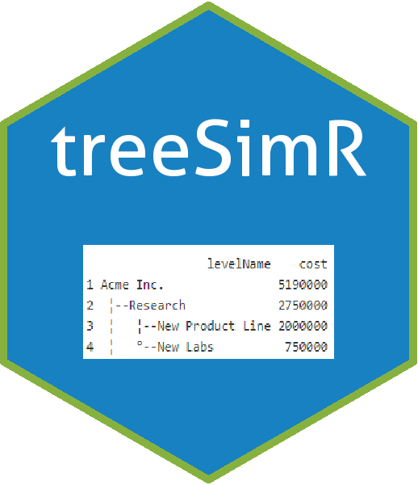

# treeSimR 

[](https://travis-ci.org/n8thangreen/treeSimR)
[](https://ci.appveyor.com/project/Hn8thangreen/treeSimR)
[](https://codecov.io/github/n8thangreen/treeSimR?branch=master)
[](http://github.com/badges/stability-badges)

<!-- README.md is generated from README.Rmd. Please edit that file -->

## Introduction

An R package for easy, robust forward simulating probability decision
trees, calculating cost-effectiveness and probability sensitivity
analysis (PSA).

Currently contains functions to:

  - read-in and check tree object
  - simulate final expected outcomes
  - Monte-Carlo simulate multiple simulations

*TODO*

  - [ ] iteratively collapse expected outcome (from right to left)
  - [ ] iteratively collapse chance nodes (from right to left)
  - [ ] optimal decision function (iterative from right to left)

The package leans heavily on the `data.tree` package, (introduction
[here](https://cran.r-project.org/web/packages/data.tree/vignettes/data.tree.html)
and examples
[here](https://cran.r-project.org/web/packages/data.tree/vignettes/applications.html)
).

## Installing treeSimR

To install the development version from github:

``` r
library(devtools)
install_github("n8thangreen/treeSimR")
```

Then, to load the package, use:

``` r
library("treeSimR")
```

See package
[Vignettes](https://n8thangreen.github.io/treeSimR/articles/vignette_main.html)
for more details and examples.

For plotting functions (e.g. C-E plane, C-E curve, risk profile (with
uncertainty), tornado, spider, …) see the
[plotCostEffectiveness](https://github.com/n8thangreen/plotCostEffectiveness)
package.

## License

GPL-3 ©
