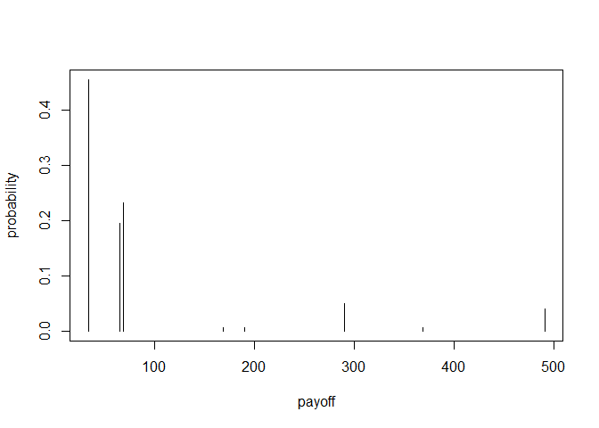

`treeSimR`
==========

An R package for easy forward simulating probability decision trees,
calculating cost-effectiveness and probability sensitivity analysis
(PSA).

Currently contains functions to:

-   read-in and check tree object
-   simulate final expected outcomes
-   Monte-Carlo simulate multiple simulations

*TODO*

-   \[ \] iteratively collapse expected outcome (from right to left)
-   \[ \] iteratively collapse chance nodes (from right to left)
-   \[ \] optimal decision function (iterative from right to left)
-   \[ \] plotting functions: C-E plane, C-E curve, risk profile (with
    uncertainty), tornado, spider, ...

The package leans heavily on the `data.tree` package, (introduction
[here](https://cran.r-project.org/web/packages/data.tree/vignettes/data.tree.html)
and examples
[here](https://cran.r-project.org/web/packages/data.tree/vignettes/applications.html)
).

Installing `treeSimR`
---------------------

To install the development version from github:

    library(devtools)
    install_github("n8thangreen/treeSimR")

Then, to load the package, use:

    library("treeSimR")

Initiate trees
--------------

    ## Loading treeSimR

Load a tree template from the package.

    # path_dtree <- system.file("raw data/LTBI_dtree-cost-distns.yaml", package = "treeSimR")
    path_dtree <- system.file("raw data/LTBI_dtree-cost_SIMPLE.yaml", package = "treeSimR")
    osList <- yaml.load_file(path_dtree)

The raw decision tree file is a tab-spaced file such as the following:

        name: LTBI screening cost
        distn: unif
        min: 0
        max: 0
        type: logical
        LTBI:
          p: 0.3
          distn: unif
          min: 0
          max: 0
          type: chance
          Not Agree to Screen:
            p: 0.65
            distn: unif
            min: 0
            max: 0
            type: terminal
          Agree to Screen:
            p: 0.35
            distn: unif
            min: 30
            max: 30
            type: chance
            Test Negative:
              p: 0.05
              distn: unif
              min: 0
              max: 0
              type: terminal
            Test Positive:
              p: 0.95
              distn: unif
              min: 0
              max: 0
              type: chance
              Not Start Treatment:
                p: 0.5
                distn: unif
                min: 0
                max: 0
                type: terminal
              Start Treatment:
                p: 0.5
                distn: unif
                min: 200
                max: 200
                type: chance
                Symptoms hepatotoxicity:
                  p: 1
                  distn: unif
                  min: 0
                  max: 0
                  type: chance
                  Symptoms nausea:
                    p: 1
                    distn: unif
                    min: 0
                    max: 0
                    type: chance
                    Complete Treatment:
                      p: 0.9
                      distn: unif
                      min: 0
                      max: 0
                      type: chance
                      Effective:
                        p: 0.9
                        distn: unif
                        min: 0
                        max: 0
                        type: terminal
                      Not Effective:
                        p: 0.1
                        distn: unif
                        min: 0
                        max: 0
                        type: terminal
                    Not Complete Treatment:
                      p: 0.1
                      distn: unif
                      min: 0
                      max: 0
                      type: terminal
        non-LTBI:
          p: 0.7
          distn: unif
          min: 0
          max: 0
          type: chance
          Not Agree to Screen:
            p: 0.65
            distn: unif
            min: 0
            max: 0
            type: terminal
          Agree to Screen:
            p: 0.35
            distn: unif
            min: 30
            max: 30
            type: chance
            Test Negative:
              p: 0.95
              distn: unif
              min: 0
              max: 0
              type: terminal
            Test Positive:
              p: 0.05
              distn: unif
              min: 0
              max: 0
              type: chance
              Not Start Treatment:
                p: 0.5
                distn: unif
                min: 0
                max: 0
                type: terminal
              Start Treatment:
                p: 0.5
                distn: unif
                min: 200
                max: 200
                type: chance
                Symptoms hepatotoxicity:
                  p: 1
                  distn: unif
                  min: 0
                  max: 0
                  type: chance
                  Symptoms nausea:
                    p: 1
                    distn: unif
                    min: 0
                    max: 0
                    type: chance
                    Complete Treatment:
                      p: 0.9
                      distn: unif
                      min: 0
                      max: 0
                      type: terminal
                    Not Complete Treatment:
                      p: 0.1
                      distn: unif
                      min: 0
                      max: 0
                      type: terminal

We save this to a .yaml text file and then give it as a yaml file to a
data.tree object using the yaml and data.tree packages. This is then
represented as a list in R.

    # osList <- yaml.load(yaml)
    osNode <- as.Node(osList)
    osNode

    ##                                             levelName
    ## 1  LTBI screening cost                               
    ## 2   ¦--LTBI                                          
    ## 3   ¦   ¦--Not Agree to Screen                       
    ## 4   ¦   °--Agree to Screen                           
    ## 5   ¦       ¦--Test Negative                         
    ## 6   ¦       °--Test Positive                         
    ## 7   ¦           ¦--Not Start Treatment               
    ## 8   ¦           °--Start Treatment                   
    ## 9   ¦               °--Symptoms hepatotoxicity       
    ## 10  ¦                   °--Symptoms nausea           
    ## 11  ¦                       ¦--Complete Treatment    
    ## 12  ¦                       ¦   ¦--Effective         
    ## 13  ¦                       ¦   °--Not Effective     
    ## 14  ¦                       °--Not Complete Treatment
    ## 15  °--non-LTBI                                      
    ## 16      ¦--Not Agree to Screen                       
    ## 17      °--Agree to Screen                           
    ## 18          ¦--Test Negative                         
    ## 19          °--Test Positive                         
    ## 20              ¦--Not Start Treatment               
    ## 21              °--Start Treatment                   
    ## 22                  °--Symptoms hepatotoxicity       
    ## 23                      °--Symptoms nausea           
    ## 24                          ¦--Complete Treatment    
    ## 25                          °--Not Complete Treatment

Better still, use the package function to do this, checking for tree
integrity and defining an additional costeffectiveness.tree class.

    CEtree <- treeSimR::costeffectiveness_tree(yaml_tree = "raw data/LTBI_dtree-cost_SIMPLE.yaml")
    osNode <- CEtree$osNode
    print(osNode, "type", "p", "distn", "mean", "sd")

    ##                                             levelName     type    p distn mean sd
    ## 1  LTBI screening cost                                 logical   NA  unif   NA NA
    ## 2   ¦--LTBI                                             chance 0.30  unif   NA NA
    ## 3   ¦   ¦--Not Agree to Screen                        terminal 0.65  unif   NA NA
    ## 4   ¦   °--Agree to Screen                              chance 0.35  unif   NA NA
    ## 5   ¦       ¦--Test Negative                          terminal 0.05  unif   NA NA
    ## 6   ¦       °--Test Positive                            chance 0.95  unif   NA NA
    ## 7   ¦           ¦--Not Start Treatment                terminal 0.50  unif   NA NA
    ## 8   ¦           °--Start Treatment                      chance 0.50  unif   NA NA
    ## 9   ¦               °--Symptoms hepatotoxicity          chance 1.00  unif   NA NA
    ## 10  ¦                   °--Symptoms nausea              chance 1.00  unif   NA NA
    ## 11  ¦                       ¦--Complete Treatment       chance 0.90  unif   NA NA
    ## 12  ¦                       ¦   ¦--Effective          terminal 0.90  unif   NA NA
    ## 13  ¦                       ¦   °--Not Effective      terminal 0.10  unif   NA NA
    ## 14  ¦                       °--Not Complete Treatment terminal 0.10  unif   NA NA
    ## 15  °--non-LTBI                                         chance 0.70  unif   NA NA
    ## 16      ¦--Not Agree to Screen                        terminal 0.65  unif   NA NA
    ## 17      °--Agree to Screen                              chance 0.35  unif   NA NA
    ## 18          ¦--Test Negative                          terminal 0.95  unif   NA NA
    ## 19          °--Test Positive                            chance 0.05  unif   NA NA
    ## 20              ¦--Not Start Treatment                terminal 0.50  unif   NA NA
    ## 21              °--Start Treatment                      chance 0.50  unif   NA NA
    ## 22                  °--Symptoms hepatotoxicity          chance 1.00  unif   NA NA
    ## 23                      °--Symptoms nausea              chance 1.00  unif   NA NA
    ## 24                          ¦--Complete Treatment     terminal 0.90  unif   NA NA
    ## 25                          °--Not Complete Treatment terminal 0.10  unif   NA NA

A neat way of exploring the tree is with the `listviewer` package
widget.

    library(listviewer)
    l <- ToListSimple(osNode)
    jsonedit(l)

Simulate a scenario
-------------------

We can now sample values for each branch, given the distributions
defined for each. This could be the cost or health detriment.

    rpayoff <- osNode$Get(sampleNode)
    osNode$Set(payoff = rpayoff)
    print(osNode, "type", "p", "distn", "mean", "sd", "payoff")

    ##                                             levelName     type    p distn mean sd payoff
    ## 1  LTBI screening cost                                 logical   NA  unif   NA NA      0
    ## 2   ¦--LTBI                                             chance 0.30  unif   NA NA      0
    ## 3   ¦   ¦--Not Agree to Screen                        terminal 0.65  unif   NA NA      0
    ## 4   ¦   °--Agree to Screen                              chance 0.35  unif   NA NA     30
    ## 5   ¦       ¦--Test Negative                          terminal 0.05  unif   NA NA      0
    ## 6   ¦       °--Test Positive                            chance 0.95  unif   NA NA      0
    ## 7   ¦           ¦--Not Start Treatment                terminal 0.50  unif   NA NA      0
    ## 8   ¦           °--Start Treatment                      chance 0.50  unif   NA NA    200
    ## 9   ¦               °--Symptoms hepatotoxicity          chance 1.00  unif   NA NA      0
    ## 10  ¦                   °--Symptoms nausea              chance 1.00  unif   NA NA      0
    ## 11  ¦                       ¦--Complete Treatment       chance 0.90  unif   NA NA      0
    ## 12  ¦                       ¦   ¦--Effective          terminal 0.90  unif   NA NA      0
    ## 13  ¦                       ¦   °--Not Effective      terminal 0.10  unif   NA NA      0
    ## 14  ¦                       °--Not Complete Treatment terminal 0.10  unif   NA NA      0
    ## 15  °--non-LTBI                                         chance 0.70  unif   NA NA      0
    ## 16      ¦--Not Agree to Screen                        terminal 0.65  unif   NA NA      0
    ## 17      °--Agree to Screen                              chance 0.35  unif   NA NA     30
    ## 18          ¦--Test Negative                          terminal 0.95  unif   NA NA      0
    ## 19          °--Test Positive                            chance 0.05  unif   NA NA      0
    ## 20              ¦--Not Start Treatment                terminal 0.50  unif   NA NA      0
    ## 21              °--Start Treatment                      chance 0.50  unif   NA NA    200
    ## 22                  °--Symptoms hepatotoxicity          chance 1.00  unif   NA NA      0
    ## 23                      °--Symptoms nausea              chance 1.00  unif   NA NA      0
    ## 24                          ¦--Complete Treatment     terminal 0.90  unif   NA NA      0
    ## 25                          °--Not Complete Treatment terminal 0.10  unif   NA NA      0

Now given the sampled values, e.g. cost, and the probabilities, we can
calculate the expected values at each node, from leaf to root.

    osNode$Do(payoff, traversal = "post-order", filterFun = isNotLeaf)

    print(osNode, "type", "p", "distn", "mean", "sd", "payoff")

    ##                                             levelName     type    p distn mean sd payoff
    ## 1  LTBI screening cost                                 logical   NA  unif   NA NA  21.70
    ## 2   ¦--LTBI                                             chance 0.30  unif   NA NA  43.75
    ## 3   ¦   ¦--Not Agree to Screen                        terminal 0.65  unif   NA NA   0.00
    ## 4   ¦   °--Agree to Screen                              chance 0.35  unif   NA NA 125.00
    ## 5   ¦       ¦--Test Negative                          terminal 0.05  unif   NA NA   0.00
    ## 6   ¦       °--Test Positive                            chance 0.95  unif   NA NA 100.00
    ## 7   ¦           ¦--Not Start Treatment                terminal 0.50  unif   NA NA   0.00
    ## 8   ¦           °--Start Treatment                      chance 0.50  unif   NA NA 200.00
    ## 9   ¦               °--Symptoms hepatotoxicity          chance 1.00  unif   NA NA   0.00
    ## 10  ¦                   °--Symptoms nausea              chance 1.00  unif   NA NA   0.00
    ## 11  ¦                       ¦--Complete Treatment       chance 0.90  unif   NA NA   0.00
    ## 12  ¦                       ¦   ¦--Effective          terminal 0.90  unif   NA NA   0.00
    ## 13  ¦                       ¦   °--Not Effective      terminal 0.10  unif   NA NA   0.00
    ## 14  ¦                       °--Not Complete Treatment terminal 0.10  unif   NA NA   0.00
    ## 15  °--non-LTBI                                         chance 0.70  unif   NA NA  12.25
    ## 16      ¦--Not Agree to Screen                        terminal 0.65  unif   NA NA   0.00
    ## 17      °--Agree to Screen                              chance 0.35  unif   NA NA  35.00
    ## 18          ¦--Test Negative                          terminal 0.95  unif   NA NA   0.00
    ## 19          °--Test Positive                            chance 0.05  unif   NA NA 100.00
    ## 20              ¦--Not Start Treatment                terminal 0.50  unif   NA NA   0.00
    ## 21              °--Start Treatment                      chance 0.50  unif   NA NA 200.00
    ## 22                  °--Symptoms hepatotoxicity          chance 1.00  unif   NA NA   0.00
    ## 23                      °--Symptoms nausea              chance 1.00  unif   NA NA   0.00
    ## 24                          ¦--Complete Treatment     terminal 0.90  unif   NA NA   0.00
    ## 25                          °--Not Complete Treatment terminal 0.10  unif   NA NA   0.00

Similarly to above, we have created a better wrapper function to perform
these steps:

    osNode <- calc_expectedValues(osNode)
    print(osNode, "type", "p", "distn", "mean", "sd", "payoff")

    ##                                             levelName     type    p distn mean sd payoff
    ## 1  LTBI screening cost                                 logical   NA  unif   NA NA  21.70
    ## 2   ¦--LTBI                                             chance 0.30  unif   NA NA  43.75
    ## 3   ¦   ¦--Not Agree to Screen                        terminal 0.65  unif   NA NA   0.00
    ## 4   ¦   °--Agree to Screen                              chance 0.35  unif   NA NA 125.00
    ## 5   ¦       ¦--Test Negative                          terminal 0.05  unif   NA NA   0.00
    ## 6   ¦       °--Test Positive                            chance 0.95  unif   NA NA 100.00
    ## 7   ¦           ¦--Not Start Treatment                terminal 0.50  unif   NA NA   0.00
    ## 8   ¦           °--Start Treatment                      chance 0.50  unif   NA NA 200.00
    ## 9   ¦               °--Symptoms hepatotoxicity          chance 1.00  unif   NA NA   0.00
    ## 10  ¦                   °--Symptoms nausea              chance 1.00  unif   NA NA   0.00
    ## 11  ¦                       ¦--Complete Treatment       chance 0.90  unif   NA NA   0.00
    ## 12  ¦                       ¦   ¦--Effective          terminal 0.90  unif   NA NA   0.00
    ## 13  ¦                       ¦   °--Not Effective      terminal 0.10  unif   NA NA   0.00
    ## 14  ¦                       °--Not Complete Treatment terminal 0.10  unif   NA NA   0.00
    ## 15  °--non-LTBI                                         chance 0.70  unif   NA NA  12.25
    ## 16      ¦--Not Agree to Screen                        terminal 0.65  unif   NA NA   0.00
    ## 17      °--Agree to Screen                              chance 0.35  unif   NA NA  35.00
    ## 18          ¦--Test Negative                          terminal 0.95  unif   NA NA   0.00
    ## 19          °--Test Positive                            chance 0.05  unif   NA NA 100.00
    ## 20              ¦--Not Start Treatment                terminal 0.50  unif   NA NA   0.00
    ## 21              °--Start Treatment                      chance 0.50  unif   NA NA 200.00
    ## 22                  °--Symptoms hepatotoxicity          chance 1.00  unif   NA NA   0.00
    ## 23                      °--Symptoms nausea              chance 1.00  unif   NA NA   0.00
    ## 24                          ¦--Complete Treatment     terminal 0.90  unif   NA NA   0.00
    ## 25                          °--Not Complete Treatment terminal 0.10  unif   NA NA   0.00

Monte Carlo forward simulation
------------------------------

We are now in a position to do a probability sensitivity analysis (PSA)
and calculate multiple realisations for specific nodes e.g. those at
which a decision is to be made.

    MonteCarlo_expectedValues(osNode, n=100)

    ## $`expected values`
    ##        [,1]
    ##   [1,] 21.7
    ##   [2,] 21.7
    ##   [3,] 21.7
    ##   [4,] 21.7
    ##   [5,] 21.7
    ##   [6,] 21.7
    ##   [7,] 21.7
    ##   [8,] 21.7
    ##   [9,] 21.7
    ##  [10,] 21.7
    ##  [11,] 21.7
    ##  [12,] 21.7
    ##  [13,] 21.7
    ##  [14,] 21.7
    ##  [15,] 21.7
    ##  [16,] 21.7
    ##  [17,] 21.7
    ##  [18,] 21.7
    ##  [19,] 21.7
    ##  [20,] 21.7
    ##  [21,] 21.7
    ##  [22,] 21.7
    ##  [23,] 21.7
    ##  [24,] 21.7
    ##  [25,] 21.7
    ##  [26,] 21.7
    ##  [27,] 21.7
    ##  [28,] 21.7
    ##  [29,] 21.7
    ##  [30,] 21.7
    ##  [31,] 21.7
    ##  [32,] 21.7
    ##  [33,] 21.7
    ##  [34,] 21.7
    ##  [35,] 21.7
    ##  [36,] 21.7
    ##  [37,] 21.7
    ##  [38,] 21.7
    ##  [39,] 21.7
    ##  [40,] 21.7
    ##  [41,] 21.7
    ##  [42,] 21.7
    ##  [43,] 21.7
    ##  [44,] 21.7
    ##  [45,] 21.7
    ##  [46,] 21.7
    ##  [47,] 21.7
    ##  [48,] 21.7
    ##  [49,] 21.7
    ##  [50,] 21.7
    ##  [51,] 21.7
    ##  [52,] 21.7
    ##  [53,] 21.7
    ##  [54,] 21.7
    ##  [55,] 21.7
    ##  [56,] 21.7
    ##  [57,] 21.7
    ##  [58,] 21.7
    ##  [59,] 21.7
    ##  [60,] 21.7
    ##  [61,] 21.7
    ##  [62,] 21.7
    ##  [63,] 21.7
    ##  [64,] 21.7
    ##  [65,] 21.7
    ##  [66,] 21.7
    ##  [67,] 21.7
    ##  [68,] 21.7
    ##  [69,] 21.7
    ##  [70,] 21.7
    ##  [71,] 21.7
    ##  [72,] 21.7
    ##  [73,] 21.7
    ##  [74,] 21.7
    ##  [75,] 21.7
    ##  [76,] 21.7
    ##  [77,] 21.7
    ##  [78,] 21.7
    ##  [79,] 21.7
    ##  [80,] 21.7
    ##  [81,] 21.7
    ##  [82,] 21.7
    ##  [83,] 21.7
    ##  [84,] 21.7
    ##  [85,] 21.7
    ##  [86,] 21.7
    ##  [87,] 21.7
    ##  [88,] 21.7
    ##  [89,] 21.7
    ##  [90,] 21.7
    ##  [91,] 21.7
    ##  [92,] 21.7
    ##  [93,] 21.7
    ##  [94,] 21.7
    ##  [95,] 21.7
    ##  [96,] 21.7
    ##  [97,] 21.7
    ##  [98,] 21.7
    ##  [99,] 21.7
    ## [100,] 21.7
    ## 
    ## $`node names`
    ## [1] "LTBI screening cost"

Pathway Probabilities
---------------------

To feed into a compartmental model like a Markov model we need state
probabilities. That is, the probability of ending-up in the one of the
terminal state of the tree that are also starting states for the other
model. These are calculated by taking the product of the probabilities
along each pathway from root to leaf.

Once again, we've written a function to do this, which we can append to
the the tree. Below we give the terminal states in a dataframe.

    path_probs <- calc_pathway_probs(osNode)
    osNode$Set(path_probs = path_probs)

    terminal_states <- data.frame(pathname = osNode$Get('pathString', filterFun = isLeaf),
                                  path_probs = osNode$Get('path_probs', filterFun = isLeaf))
    terminal_states

    ##                                                                                                                                           pathname path_probs
    ## 1                                                                                                     LTBI screening cost/LTBI/Not Agree to Screen 0.19500000
    ## 2                                                                                           LTBI screening cost/LTBI/Agree to Screen/Test Negative 0.00525000
    ## 3                                                                       LTBI screening cost/LTBI/Agree to Screen/Test Positive/Not Start Treatment 0.04987500
    ## 4      LTBI screening cost/LTBI/Agree to Screen/Test Positive/Start Treatment/Symptoms hepatotoxicity/Symptoms nausea/Complete Treatment/Effective 0.04039875
    ## 5  LTBI screening cost/LTBI/Agree to Screen/Test Positive/Start Treatment/Symptoms hepatotoxicity/Symptoms nausea/Complete Treatment/Not Effective 0.00448875
    ## 6            LTBI screening cost/LTBI/Agree to Screen/Test Positive/Start Treatment/Symptoms hepatotoxicity/Symptoms nausea/Not Complete Treatment 0.00498750
    ## 7                                                                                                 LTBI screening cost/non-LTBI/Not Agree to Screen 0.45500000
    ## 8                                                                                       LTBI screening cost/non-LTBI/Agree to Screen/Test Negative 0.23275000
    ## 9                                                                   LTBI screening cost/non-LTBI/Agree to Screen/Test Positive/Not Start Treatment 0.00612500
    ## 10           LTBI screening cost/non-LTBI/Agree to Screen/Test Positive/Start Treatment/Symptoms hepatotoxicity/Symptoms nausea/Complete Treatment 0.00551250
    ## 11       LTBI screening cost/non-LTBI/Agree to Screen/Test Positive/Start Treatment/Symptoms hepatotoxicity/Symptoms nausea/Not Complete Treatment 0.00061250

Specifically, the starting state probabilities of the subsequent
compartmental model are for aggregated sub-populations. We can simply
sum over these in an ad-hoc way.

The non-LTBI individuals either never had LTBI or where successfully
treated.

    startstate.nonLTBI <- grepl("/Complete Treatment", x = terminal_states$pathname) | grepl("nonLTBI", x = terminal_states$pathname)
    startstate.LTBI <- !startstate.nonLTBI

The expected proportion of individuals in LTBI and non-LTBI after
screening is thus,

    healthstatus <- NA
    healthstatus[startstate.nonLTBI] <- "nonLTBI"
    healthstatus[startstate.LTBI] <- "LTBI"

    aggregate(terminal_states$path_probs, by=list(healthstatus), FUN=sum)

    ##   Group.1      x
    ## 1    LTBI 0.9496
    ## 2 nonLTBI 0.0504

Further, we can sample from the terminal state probabilities to give a
sample of compartmental model start state proportions. This can capture
the variability due to the cohort size.

    samplesize <- 100000
    numsamples <- 10

    sample.mat <- matrix(NA, nrow = nrow(terminal_states), ncol = numsamples)
    for (i in 1:numsamples){
      
      sample.mat[,i] <- table(sample(x = 1:nrow(terminal_states), size = samplesize, prob = terminal_states$path_probs, replace = TRUE))/samplesize
    }

    head(sample.mat)

    ##         [,1]    [,2]    [,3]    [,4]    [,5]    [,6]    [,7]    [,8]    [,9]   [,10]
    ## [1,] 0.19297 0.19543 0.19542 0.19602 0.19390 0.19570 0.19294 0.19709 0.19428 0.19332
    ## [2,] 0.00549 0.00546 0.00530 0.00536 0.00551 0.00503 0.00523 0.00524 0.00514 0.00525
    ## [3,] 0.05041 0.04981 0.04897 0.04980 0.04960 0.04982 0.05049 0.04918 0.04911 0.04994
    ## [4,] 0.04059 0.04092 0.03956 0.04143 0.03996 0.04032 0.04094 0.03969 0.04072 0.04080
    ## [5,] 0.00455 0.00439 0.00459 0.00483 0.00419 0.00448 0.00467 0.00475 0.00486 0.00489
    ## [6,] 0.00492 0.00514 0.00498 0.00511 0.00542 0.00483 0.00510 0.00492 0.00521 0.00505

    apply(sample.mat, 2, function(x) aggregate(x, by=list(healthstatus), FUN=sum))

    ## [[1]]
    ##   Group.1       x
    ## 1    LTBI 0.94894
    ## 2 nonLTBI 0.05106
    ## 
    ## [[2]]
    ##   Group.1      x
    ## 1    LTBI 0.9489
    ## 2 nonLTBI 0.0511
    ## 
    ## [[3]]
    ##   Group.1       x
    ## 1    LTBI 0.95062
    ## 2 nonLTBI 0.04938
    ## 
    ## [[4]]
    ##   Group.1       x
    ## 1    LTBI 0.94811
    ## 2 nonLTBI 0.05189
    ## 
    ## [[5]]
    ##   Group.1       x
    ## 1    LTBI 0.95008
    ## 2 nonLTBI 0.04992
    ## 
    ## [[6]]
    ##   Group.1      x
    ## 1    LTBI 0.9498
    ## 2 nonLTBI 0.0502
    ## 
    ## [[7]]
    ##   Group.1       x
    ## 1    LTBI 0.94902
    ## 2 nonLTBI 0.05098
    ## 
    ## [[8]]
    ##   Group.1       x
    ## 1    LTBI 0.94994
    ## 2 nonLTBI 0.05006
    ## 
    ## [[9]]
    ##   Group.1       x
    ## 1    LTBI 0.94875
    ## 2 nonLTBI 0.05125
    ## 
    ## [[10]]
    ##   Group.1       x
    ## 1    LTBI 0.94839
    ## 2 nonLTBI 0.05161

The function to do this is

    get_start_state_proportions(terminal_states$path_probs, healthstatus, samplesize, numsamples)

Risk Profile
------------

Further, the pathway probabilities can be used to give the distribution
of the terminal state values e.g. cost or time. This is called the risk
profile of the decision tree.

    osNode <- calc_riskprofile(osNode)
    print(osNode, "type", "path_prob", "path_payoff")

    ##                                             levelName     type  path_prob path_payoff
    ## 1  LTBI screening cost                                 logical 1.00000000       21.70
    ## 2   ¦--LTBI                                             chance 0.30000000       65.45
    ## 3   ¦   ¦--Not Agree to Screen                        terminal 0.19500000       65.45
    ## 4   ¦   °--Agree to Screen                              chance 0.10500000      190.45
    ## 5   ¦       ¦--Test Negative                          terminal 0.00525000      190.45
    ## 6   ¦       °--Test Positive                            chance 0.09975000      290.45
    ## 7   ¦           ¦--Not Start Treatment                terminal 0.04987500      290.45
    ## 8   ¦           °--Start Treatment                      chance 0.04987500      490.45
    ## 9   ¦               °--Symptoms hepatotoxicity          chance 0.04987500      490.45
    ## 10  ¦                   °--Symptoms nausea              chance 0.04987500      490.45
    ## 11  ¦                       ¦--Complete Treatment       chance 0.04488750      490.45
    ## 12  ¦                       ¦   ¦--Effective          terminal 0.04039875      490.45
    ## 13  ¦                       ¦   °--Not Effective      terminal 0.00448875      490.45
    ## 14  ¦                       °--Not Complete Treatment terminal 0.00498750      490.45
    ## 15  °--non-LTBI                                         chance 0.70000000       33.95
    ## 16      ¦--Not Agree to Screen                        terminal 0.45500000       33.95
    ## 17      °--Agree to Screen                              chance 0.24500000       68.95
    ## 18          ¦--Test Negative                          terminal 0.23275000       68.95
    ## 19          °--Test Positive                            chance 0.01225000      168.95
    ## 20              ¦--Not Start Treatment                terminal 0.00612500      168.95
    ## 21              °--Start Treatment                      chance 0.00612500      368.95
    ## 22                  °--Symptoms hepatotoxicity          chance 0.00612500      368.95
    ## 23                      °--Symptoms nausea              chance 0.00612500      368.95
    ## 24                          ¦--Complete Treatment     terminal 0.00551250      368.95
    ## 25                          °--Not Complete Treatment terminal 0.00061250      368.95

    plot(data.frame(osNode$Get('path_payoff', filterFun = isLeaf),
               osNode$Get('path_prob', filterFun = isLeaf)), type="h",
         xlab="payoff", ylab="probability")

Optimal decisions
-----------------

We can get the software to calculate the optimal decision for us, rather
than returning the expections to compare. This can be done from right to
left, iteratively.

    ##TODO##
    osNode$Do(decision, filterFun = function(x) x$type == 'decision')
    osNode$Get('decision')[1]

    ##TODO##
    ## probabilty of successfully & correctly treating LTBI
    dummy <- rep(0, osNode$totalCount)
    dummy[12] <- 1
    osNode$Set(payoff = dummy)
    print(osNode, "type", "p", "distn", "mean", "sd", "payoff")
    osNode$Do(payoff, traversal = "post-order", filterFun = isNotLeaf)
    print(osNode, "type", "p", "distn", "mean", "sd", "payoff")
    osNode$Get('payoff')[1]
